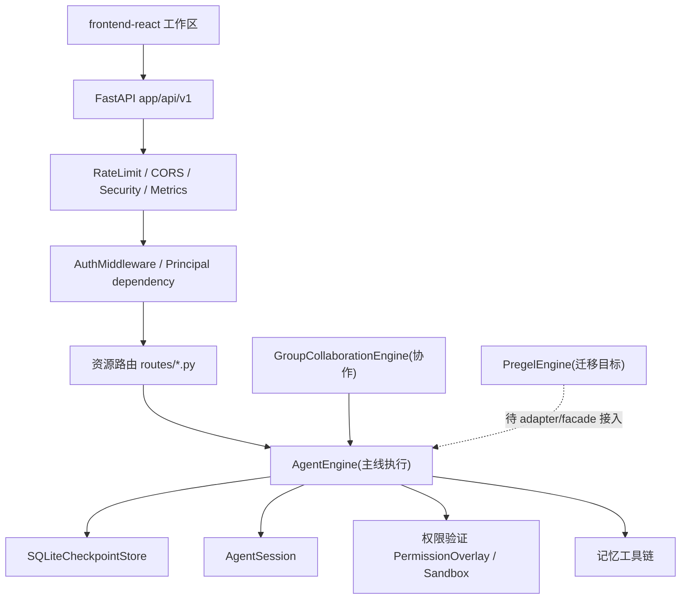
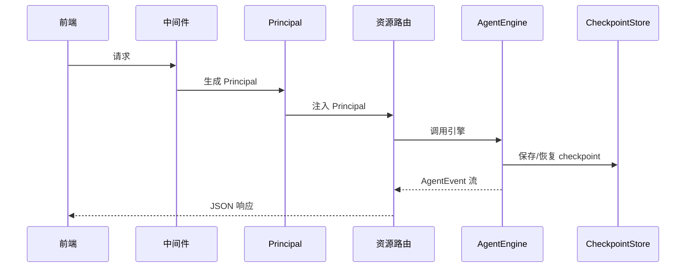

# 系统架构

> 本文档描述 `agent-engine` 的当前实现。状态以真实代码为准，计划态明确标注"迁移目标"。

## 架构总览

## 组件

### 执行内核

- `app/main.py` 启动时注册 `AgentEngine` 为 DI 单例（`main.py:73`），`WorkflowEngine`、`Crew`、`AutoLoopEngine` 均以其为执行核心。
- `AgentEngine` 的对外协议是 `async for event in engine.run(session, message)`，事件类型为 `AgentEvent`。已提供 `run_agent()` 兼容方法返回 `output` 与 `tokens_used`。
- `app/core/engine/pregel/` 为图执行内核，已完成并发隔离、interrupt_before/after、timeout、流广播与 checkpoint 排序加固。**当前主线入口仍为 AgentEngine**，Pregel 接入属于后续迁移，通过 adapter/facade 保持协议后分入口切换。

### 持久化与会话

- `SQLiteCheckpointStore`（`app/core/checkpoint.py`）完整保存与恢复 `channel_values`、`channel_versions`、`versions_seen`、`pending_writes`、`tool_results`；`ensure_checkpoint_schema()` 幂等补列，历史记录缺失字段使用安全默认值。
- `AgentSession` 主实现位于 `app/core/session.py`；`app/core/engine/session.py` 为其兼容 re-export facade。
- `AgentSession.snapshot()/from_snapshot()` 序列化 config/messages/status/iteration/stop/error 等安全字段，排除锁、事件与任务等运行时对象。
- `app/core/recovery.py` 与 `app/api/v1/chat.py` 在内存会话缺失时从 checkpoint 恢复；仅中断 checkpoint 进入 resume 状态，正常新 turn 作为历史上下文。

### 多 Agent 协作

- `app/core/collaboration/base.py` 的 `GroupCollaborationEngine` 是功能最完整且有生产入口的协作主实现，覆盖持久化、DAG、review、guardrail、human review、checkpoint、memory、callback 与 WebSocket。
- `app/multi_agent/crew.py`（CrewExecutorAdapter）转换真实 `CrewOutput` 为标准 `ExecutionResult`；`app/engine/multi_agent.py`（MultiAgentOrchestrator）同步协议调用引擎并以 `AgentEventType.TEXT` 比较事件。
- `app/tools/builtins.py` 通过延迟工厂 `get_group_collaboration_engine()` 获取协作引擎，禁止缓存 None 单例。

### 安全与权限

- 认证链：`AuthMiddleware` 写入 `request.state.auth` → `get_current_principal` 生成 `Principal`（`app/core/principal.py`）并写入 request-scoped `ContextVar`。
- local 模式（`ENABLE_AUTH=false`）仅在 Principal dependency 处生成 `default-user`；认证模式缺失身份返回 401。
- 权限决策：`PermissionOverlay` 更具体 scope 优先，同层按 `DENY > ASK > ALLOW`；工具调用命中 ASK 时创建 pending permission、发送审批事件、等待 `resolve_permission()`，超时 fail-closed；批准后仍执行 schema 与 sandbox 验证。
- `app/tools/api_tools.py` HTTP 工具接入 SSRF 防护；未认证 WebSocket 返回 4401。

### 多租户与 API 契约

- `app/schemas/api_v1/` 提供命名 Pydantic 写请求模型，`extra=forbid`，兼容 `{data:{...}}` envelope。
- Agents/Workflows/Crews/Groups/Tasks/Skills 写端点已迁移；Workflow/Crew run 仅选择当前 Principal 拥有的 Agent，group member 与 task worker/reviewer 均验证归属。
- Agent 响应脱敏隐藏 `api_key`、`env` 等字段。
- 限流键使用 `auth_method:tenant_id:subject_id`（`Principal.identity_key`）。
- `ToolGateway`、`MemoryToolContext` 与记忆工具链全链传播真实 Principal；认证模式缺失身份 fail closed。

### 基础设施

- `app/main.py` 注册 `RateLimitMiddleware`（仅受信代理读取转发头）、CORS、SecurityHeaders、Metrics 与 RequestValidation；401/403/429/500 响应仍携带 CORS、安全头与 metrics。
- 静态托管 `frontend-react/dist`，SPA fallback；dist 缺失 index.html 时启动明确报错。
- `APP_SECRET_KEY` 移除随机回退：认证启用或 production/staging 缺失稳定 key 快速失败；local/test 使用稳定持久开发密钥。
- prompt templates 单一前缀 `/api/v1/prompt-templates`，固定子路由位于 `/{template_id}` 之前。
- reasoning feedback 经 `trace_id` 关联 `ReasoningFeedbackDB` 并校验归属；普通 message feedback 校验真实 message；eval run 校验 dataset/agent 归属返回受控 422/404。
- `IntegrityError` 回滚并映射 409/422，避免 crash dump 堆栈膨胀。
- `Dockerfile` 多阶段构建前端并复制 dist 到运行镜像。

### 前端工作区

- `frontend-react/src/App.tsx`（Hash 路由真实入口）与 `main.tsx`。
- 桌面：稳定侧栏 + 顶部上下文栏 + 主内容三栏层级（`WorkspaceLayout.tsx`）。
- 移动：底部导航 5 项（概览/对话/智能体/工作流/更多），"更多"覆盖其余真实路由。
- Chat 会话栏/线程/Composer/上下文面板；Agents 高密度列表 + 三步创建；Workflows 列表/画布入口；Dashboard 展示真实 API 状态；Settings 分组侧栏。
- 统一语义 token、4/8 spacing、12/14/16 字号、44px 触控、键盘焦点、reduced-motion、loading/empty/error/disabled 状态。

## 数据流（请求处理）

## 关键决策

- 统一架构优先于功能堆叠：引擎、记忆、协作、安全、多用户先收敛边界。
- 主线协议保持 `create_session()/run()/AgentEvent`；Pregel 接入采用 adapter/facade 分入口切换，避免一次性破坏 Chat/Workflow/Crew 调用协议。
- `GroupCollaborationEngine` 作为唯一多 Agent 主实现目标，Crew 与 MultiAgentOrchestrator 收敛为适配层。
- 唯一权限决策接口与策略数据源；沙箱只负责执行隔离。
- 统一 `Principal` 与 repository 用户隔离；写接口逐步迁移命名 schema 与 `response_model`。

## 已知迁移项

- Pregel adapter/facade 与主线入口切换；收敛 `app/core/pregel_loop.py`、`state_graph.py`、`channels.py` 旧实现。
- 清理业务路径剩余 `DEFAULT_USER`（`app/` 内约 71 处）与剩余 generic 写端点 schema。
- 修复 Alembic `52310c24d4c8` 重复建表与 `down_revision` 链。
- Crew/Orchestrator 完全收敛为 GroupCollaborationEngine 适配层；权限策略源统一。
- 停止并发 watch_tests 后执行可信后端全量实际运行。
