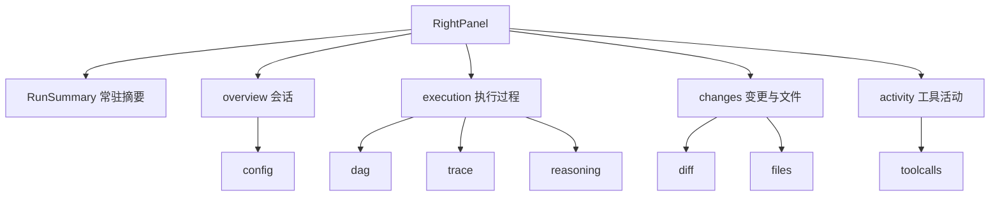

# 右侧面板信息架构规范

适用范围：`src/components/workspace/RightPanel.tsx`、`ControlBar.tsx`、
`src/components/workspace/rightPanel/**`。

## 1. 问题定义

原实现把配置、Diff、工具、DAG、链路、推理、文件七项做成平级 Tab，同时在
`ControlBar` 放七个图标按钮。这带来三个具体缺陷：

1. **等权误导**：七项的信息价值差异极大。`配置` 与 `DAG` 属于会话元数据，
   `Diff` 属于运行结果，工具调用属于高频操作，等权排列迫使用户逐个点开试探。
2. **入口重复**：工具栏七图标与面板七 Tab 功能重叠，窄屏下工具栏挤压严重。
3. **状态不可见**：会话是否在运行、Token 用了多少、有没有错误，只有切到具体
   Tab 才能看到，无法在面板顶部一眼判断。

## 2. 目标结构

- **第一层（常驻）**：`RunSummary`。任何 Tab 下都渲染，承载状态、模型、
  Token 进度、工具数、错误数、沙箱提示。
- **第二层（渐进披露）**：四个可折叠分组。分组展开后才渲染内容，
  避免未展开的分区发起请求。
- **第三层（仅多分区组）**：分组内子 Tab。只有 `execution`（3 项）与
  `changes`（2 项）出现；单分区组不显示子 Tab。

## 3. 分组定义

| 分组 | id | 默认分区 | 子分区 | 无会话时 |
|---|---|---|---|---|
| 会话 | `overview` | `config` | config | 可用 |
| 执行过程 | `execution` | `dag` | dag / trace / reasoning | 可用 |
| 变更与文件 | `changes` | `diff` | diff / files | 回落到 files |
| 工具活动 | `activity` | `toolcalls` | toolcalls | 禁用 |

`changes` 的默认分区 `diff` 需要会话。无会话时 `resolveGroupTab()` 回落到
`files`，保证分组入口永远不是死路。`activity` 唯一分区需要会话，因此整个
按钮禁用并在 `title` 上给出「先选择会话」提示。

## 4. 交互契约

- 面板关闭时不渲染任何 DOM（`rightPanelOpen === false` → `null`）。
- 折叠状态保存在 `RightPanel` 局部 state，`rightPanelTab` 变化时自动展开
  对应分组（`useEffect` 监听 `rightPanelTab`），保证从 `ControlBar` 跳转时
  目标内容一定可见。
- 手动折叠当前分组不会被自动展开逻辑覆盖——只有 `rightPanelTab` 真正变化
  才触发展开。
- 折叠箭头用 `ChevronRight` 旋转 90° 表示展开，避免引入第二套图标。
- 存储层的 `rightPanelTab` 保留七个值不变，`ControlBar` 与面板共享同一
  `TAB_TO_GROUP` 映射，深链与外部调用无需改动。

## 5. 状态表达规范

三态显式区分，缺省与失败都必须声明，不允许静默空白：

| 状态 | 组件 | 表现 |
|---|---|---|
| 加载中 | `PanelLoading` | `role="status"` + `aria-busy` + 递减透明度骨架行 |
| 空数据 | `PanelEmpty` | 图标 + 主文案 + 下一步提示（说明如何产生数据） |
| 请求失败 | `PanelError` | 警告图标 + `role="alert"` + 重试按钮，触发 `reload()` |

`useAsyncData()` 统一封装请求生命周期，返回 `{ data, loading, error, reload }`，
保证四个分区的加载/失败/重试行为完全一致。

## 6. 状态视觉规则

- 状态色只用语义 token：`--color-success` / `--color-warning` / `--color-error`
  / `--color-info` / `--color-accent`。
- 状态同时用图标 + 文案表达，不依赖颜色单独承载信息。
- Token 进度条阈值：`< 75%` 用 `--color-info`，`75%~90%` 用 `--color-warning`，
  `>= 90%` 用 `--color-error`，与 `ControlBar` 的既有阈值一致。
- 进度条带 `role="progressbar"` 与 `aria-valuenow`，可被读屏与测试断言。
- DAG 节点状态：完成=实心 success，运行中=实心 accent + `animate-pulse`，
  待办=空心 border。

## 7. 文件划分

| 文件 | 职责 |
|---|---|
| `RightPanel.tsx` | 组装：头部、摘要、分组手风琴、Tab 路由 |
| `rightPanel/groupModel.ts` | 纯元数据：分组、子分区、默认分区、可用性判定 |
| `rightPanel/RunSummary.tsx` | 常驻摘要卡 |
| `rightPanel/PanelState.tsx` | 状态原语与 `useAsyncData` |
| `rightPanel/sections/ConfigSection.tsx` | 会话配置 |
| `rightPanel/sections/ExecutionSection.tsx` | DAG + 链路 |
| `rightPanel/sections/ChangesSection.tsx` | Diff + 文件 |
| `rightPanel/sections/ActivitySection.tsx` | 工具调用 |

分组元数据与渲染分离：`groupModel.ts` 不含 JSX，可直接被 `ControlBar` 与
`RightPanel` 共享，也便于单测。

## 8. 验证

`src/components/workspace/rightPanel/__tests__/RightPanel.test.tsx` 覆盖：

- 面板关闭不渲染
- 摘要跨 Tab 常驻
- 工具/错误计数由 `session.messages` 推导
- 无会话时的空提示
- 四个分组的 `aria-expanded` 存在性
- 分组跟随 `rightPanelTab` 自动展开
- 单分区组无子 Tab、多分区组有子 Tab
- 全部折叠/全部展开
- 空状态文案

`src/components/workspace/__tests__/ControlBar.test.tsx` 覆盖分组入口、
可用性判定与默认分区回落。

## 9. 参考来源

- LobeHub：会话元数据与对话区分栏，模型/工具配置作为会话属性
- Open WebUI：模型与工具选择随会话保存，面板顶部常驻会话信息
- LibreChat：Agent 模式下工具调用与文件产出并列在同一侧栏
- Dify：运行详情用分组折叠，参数面板与结果面板分离
- OpenHands / SWE-agent：Diff 作为一等公民独立成组，变更优先于执行日志
- Cline / RooCode：工具调用按时间折叠，默认收起
- browser-use：步骤轨迹以状态点 + 连接线呈现运行进度
- AgentTrace：调用链按 LLM / 工具分色，token 与耗时同屏
