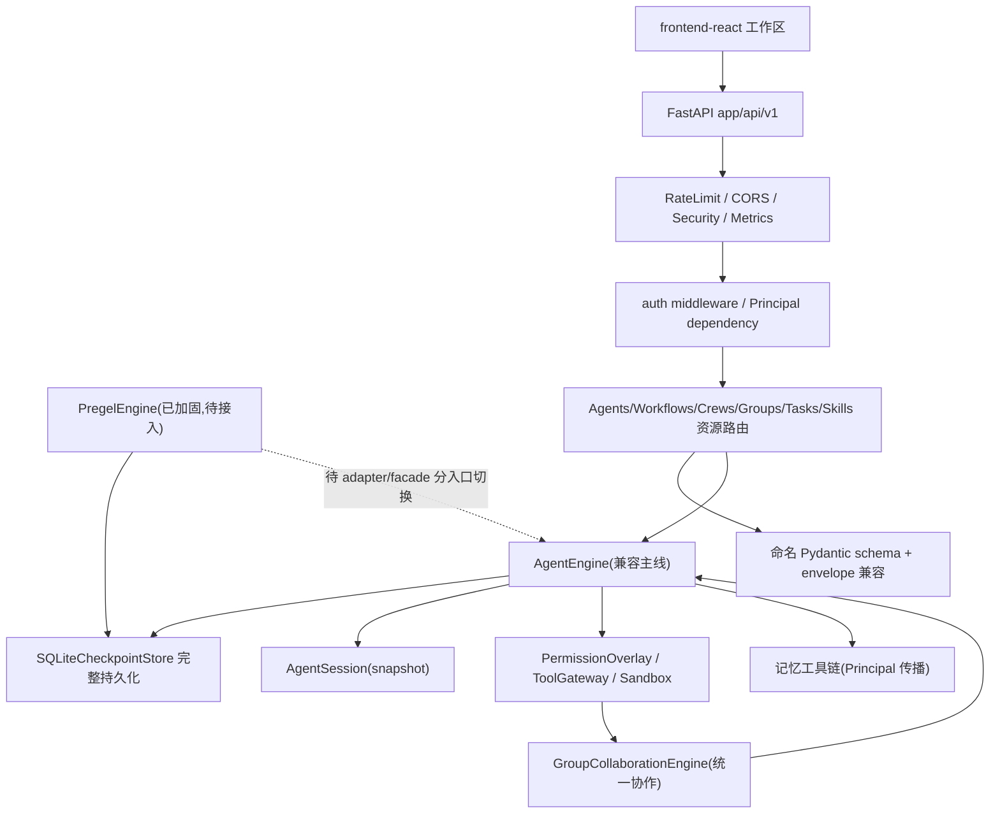

# 统一 Agent 平台架构设计

Feature Name: unified-agent-platform
Updated: 2026-08-05

## Description

本设计固化六路架构审计的结论与首批实施成果，明确执行内核、持久化、多 Agent、权限、多租户、基础设施与前端工作区的当前态与迁移路径。设计严格区分"已落地基座"与"后续迁移"，禁止将计划态描述为已实现。

## Architecture

## Components and Interfaces

### 执行内核

- `AgentEngine`（`app/core/agent_engine.py`）：当前唯一真实入口。协议为 `async for event in engine.run(session, message)`，事件类型为 `AgentEvent`。已补 `run_agent()` 兼容方法，返回 output 与 tokens_used。
- `PregelEngine`（`app/core/engine/pregel/`）：本轮已加固 ExecutionContext 并发隔离、interrupt_before/after、node/run timeout、StreamManager 广播、checkpoint 排序与分页。**后续迁移**：通过 adapter/facade 保持 `create_session()/run()/AgentEvent` 协议，再分低风险入口切换到 Pregel。

### 持久化与会话

- `app/core/checkpoint.py`：SQLiteCheckpointStore 完整保存/恢复 channel_values、channel_versions、versions_seen、pending_writes、tool_results；`ensure_checkpoint_schema()` 幂等补列，旧记录安全默认。
- `app/core/session.py`：AgentSession 主实现；`snapshot()/from_snapshot()` 覆盖安全字段并排除运行时对象。
- `app/core/engine/session.py`：兼容 re-export facade。
- `app/core/recovery.py` 与 `app/api/v1/chat.py`：内存缺失时从 checkpoint 恢复，中断 checkpoint 才进入 resume 状态。

### 多 Agent 协作

- `app/core/collaboration/base.py`：GroupCollaborationEngine 主实现，覆盖持久化、DAG、review、guardrail、human review、checkpoint、memory、callback、WebSocket。
- `app/multi_agent/crew.py`：CrewExecutorAdapter 转换真实 CrewOutput 为标准 ExecutionResult。
- `app/engine/multi_agent.py`：MultiAgentOrchestrator 同步 create_session、AgentEventType.TEXT 比较、实际使用 roles。
- `app/tools/builtins.py`：延迟工厂 `get_group_collaboration_engine()`，消除 None 缓存。

### 安全与权限

- `app/core/engine/validation.py`：ASK 返回结构化 requires_approval。
- `app/core/agent_engine.py`：创建 pending permission、发送审批事件、等待 resolve_permission、超时 fail-closed、批准后仍执行 schema 与 sandbox 验证。
- `PermissionOverlay`：更具体 scope 优先，同层 DENY > ASK > ALLOW，user deny 覆盖 default allow。

### 多租户与 API 契约

- `app/core/principal.py`：Principal（subject_id/tenant_id/role/scopes/auth_method）+ CurrentPrincipal dependency + request-scoped ContextVar。local 模式仅此处生成 default-user。
- `app/schemas/api_v1/`：命名 Pydantic 写请求模型，extra=forbid，支持 `{data:{...}}` envelope 兼容 validator，响应脱敏 api_key/env。
- `app/api/v1/routes/agents.py|workflows.py|crews.py|groups.py|tasks.py|skills.py`：首批迁移的六类资源写端点，workflow/crew run 仅选择当前 Principal 拥有的 Agent。
- `app/middleware/rate_limit.py`：限流键使用 `auth_method:tenant_id:subject_id`。
- `app/core/tool_gateway.py` 与记忆工具链：传播真实 Principal，认证模式缺失身份 fail closed。

### 基础设施

- `app/main.py`：注册 RateLimitMiddleware，受信代理读取转发头；静态服务 frontend-react/dist，SPA fallback，缺 index 快速报错；WebSocket 在应用边界显式注册。
- `app/config.py`：APP_SECRET_KEY 移除随机回退；认证/生产/预发缺失稳定 key 快速失败，local/test 使用稳定持久开发 key。
- `app/api/v1/prompt_templates.py`：单一 `/api/v1/prompt-templates` 前缀，固定子路由在参数路由前。
- `app/api/v1/feedback.py`：reasoning feedback 经 trace_id 关联 ReasoningFeedback 并校验归属；普通 message feedback 校验真实 message。
- `Dockerfile`：多阶段构建前端并复制 dist 到运行镜像。

### 前端工作区

- `frontend-react/src/App.tsx`、`main.tsx`：Hash 路由真实入口。
- `WorkspaceLayout.tsx`：桌面稳定侧栏 + 上下文栏 + 主内容。
- 移动端：底部导航 5 项，`更多`覆盖其余真实路由。
- `ChatPage/AgentsPage/WorkflowsPage/DashboardPage/SettingsPage`：真实数据、loading/empty/error/disabled 状态、44px 触控、键盘焦点、reduced-motion。

## Data Models

- `CheckpointData`：channel_values、channel_versions、versions_seen、pending_writes、tool_results、next_nodes、parent checkpoint 引用。
- `AgentSession.snapshot`：config/context、messages、status、iteration、stop、error、tool results、turn/pause/terminate/resume 状态；排除 Lock/Event/Task。
- `Principal`：subject_id、tenant_id、role、scopes、auth_method。
- 资源写请求 schema：命名 Pydantic 模型，extra=forbid，`{data:{...}}` envelope 兼容。

## Correctness Properties

- 同一 compiled graph 并发 thread 不串线；缺 thread_id 生成独立 UUID。
- interrupt_before/after 恢复顺序正确；checkpoint 排序按 step/created_at/id。
- checkpoint 字段 roundtrip 完整且旧 schema 兼容；不同 session 隔离。
- PermissionOverlay 优先级确定；ASK 超时 fail-closed；批准后二次验证。
- 资源引用（group member、task worker/reviewer、workflow agent）均验证归属。
- OpenAPI operation ID 全局唯一；写端点出现命名 requestBody；尾斜杠兼容路由不进 schema。
- 401/403/429/500 响应仍携带 CORS、security headers、metrics。

## Error Handling

- 权限 ASK 超时：fail-closed 阻断工具，向事件流输出错误。
- Pregel timeout：进入 ErrorHandler，事件流输出 ERROR。
- IntegrityError：rollback 并映射 409/422，抑制 crash dump 堆栈膨胀。
- eval run 非法 dataset/agent：受控 422/404，避免 FK 500。
- 静态托管缺 index：启动即明确报错。
- 认证/生产缺失稳定 secret：快速失败。

## Test Strategy

- 后端：联合回归集合（Pregel 加固、checkpoint/session 持久化、多 Agent 统一、基础设施修复、Principal/API 契约、smoke）共 103 项。
- 静态：compileall、ruff、OpenAPI paths/operations/operation ID 唯一性。
- 前端：typecheck、生产 build、380 文件/3305 项 Vitest、Playwright 1440/768/375 三视口（scrollWidth、导航可达、44px、键盘焦点）。
- 门禁：真实执行，禁止 skip/排除/修改断言。

## Migration Roadmap

- 已落地基座：Pregel runtime 加固、checkpoint/session 持久化、多 Agent P0、权限 ASK fail-closed、Principal 首批六类资源、基础设施故障修复、前端工作区重构。
- 后续迁移：
  1. Pregel adapter/facade 并分低风险入口切换主线；`app/core/pregel_loop.py`/`state_graph.py`/`channels.py` 第三套旧实现收敛。
  2. 剩余 `DEFAULT_USER` 散布点与 generic 写端点迁移到命名 schema/response_model。
  3. Alembic 迁移链修复（`52310c24d4c8` 重复建表与 down_revision）。
  4. Crew/MultiAgentOrchestrator 完全收敛为 GroupCollaborationEngine 适配层；权限策略源与沙箱统一。
  5. 停止并发 watch_tests 后执行可信后端全量实际运行；治理前端 act 警告。

## References

- [requirements.md](./requirements.md) - 需求规格
- `app/core/agent_engine.py` - 主线执行引擎
- `app/core/engine/pregel/` - 加固后的图执行内核
- `app/core/checkpoint.py` - checkpoint 完整持久化
- `app/core/principal.py` - Principal 身份
- `app/main.py` - 基础设施注册
- `frontend-react/src/App.tsx` - 前端真实入口
