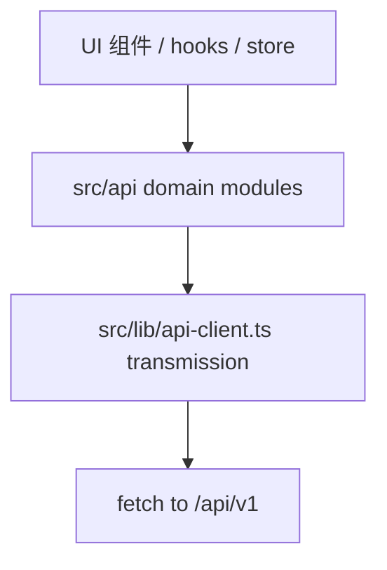

# 前端代码层重构方案

> 范围：`/workspace/climber/frontend-react`（React 19 + Vite + Tailwind v4）
> 性质：方案与调研，不含源码改动
> 依据：本次实际阅读的源码与行号
> 关联：`.monkeycode/specs/2026-09-25-frontend-rebuild/tasklist.md`（阶段 5.3 已触及数据层，但未收敛）

---

## 0. 证据总览

| 问题 | 关键证据（文件:行） | 核实结论 |
|------|--------------------|---------|
| 三套数据层并存 | `src/api.ts:823`、`src/lib/api-client.ts:117`、`src/services/*` 共 7 文件 494 行 | 成立，且比预期更严重：标准 5 个 Service 在非测试代码中零调用 |
| token 存 localStorage | `src/lib/api-client.ts:10`、`src/api.ts:116,157`、`src/legacy/store/auth.ts:136` | 成立，存在两套 key：`auth_token` 与 `climber-auth` |
| 巨型文件 | `src/api.ts:823`、`src/pages/SettingsPage.tsx:780`、`src/pages/FactoryModePage.tsx:704` | 成立 |
| 死依赖 react-query | `package.json:34` | 成立，已计划移除，本文不处理 |
| 无障碍 | `<button` 285 处，带 `type` 65 处；`
` 8 处 | 约 220 处 button 缺 type，8 处 div onClick |
| ThinkingIndicator 多定时器 | `src/components/agent/ThinkingIndicator.tsx:39,49,59,163` | 成立（组件内 3 个，同文件 ThinkingDots 1 个） |
| SessionSidebar focus 刷新 | `src/components/workspace/SessionSidebar.tsx:67` | 成立 |
| LazyImage 三重机制 + 双写 | `src/components/mobile/LazyImage.tsx:29,33,72,82` | 成立 |
| useTheme 回退错误 | `src/hooks/useTheme.tsx:59,90` | 成立，系统非 light 时回退 `defaultTheme` |

---

## 1. 三套数据层现状与收敛路径

### 1.1 现状对比表

| 维度 | A. `src/api.ts` | B. `src/lib/api-client.ts` | C. `src/services/*Service.ts` |
|------|-----------------|----------------------------|-------------------------------|
| 行数 | 823 | 117 | 合计 494（agent 84 / chat 129 / workflow 102 / tool 52 / mcp 70 / cluster 20 / index 20） |
| 形态 | `class ApiClient` + 单例 `export const api`（`api.ts:823`） | 函数式 `request` + `apiClient` 对象（`api-client.ts:79`） | 对象常量 `xxxService`，内部转调 `apiClient` |
| Base URL | `BASE_URL = '/api/v1'`，`fetch(\`${BASE_URL}${path}\`)`（`api.ts:1,171`） | `API_BASE_URL = '/api/v1'`，`normalizePath` 剥掉入参里的 `/api`、`/api/v1`（`api-client.ts:1,3,51`） | 无自有 base，全部经 `apiClient` |
| 认证 | 复用 `getAuthHeaders()`（`api.ts:139`），自带 401 刷新（`api.ts:142-190`） | `getToken()` 读 `localStorage['auth_token']`（`api-client.ts:10`），无刷新 | 无自有认证 |
| 错误类型 | 抛 `Error`（`api.ts:194`） | 抛 `ApiError`（`api-client.ts:21,65`） | 透传 `ApiError` |
| 覆盖实体 | 全部（Agents/Sessions/Chat/Tools/Models/Workflows/Crews/ApiKeys/Stats/Skills/Cluster/Groups/Documents/Traces/Plugins/Reasoning/Feedback/Settings/Tasks/Terminal/Cost/Scheduler/MCP/Eval/Search/Permissions/Auth） | 无实体，仅传输层 | Agent/Chat/Workflow/Tool/MCP/Cluster |
| 生产调用方 | ChatInterface、GroupRoom、WorkflowEditor、ReasoningPanel、RightPanel、GlobalSearch、TraceViewer、CollaborationConsole、CostPage、ClusterPage、SchedulerPage、PluginsPage、TerminalPage、AgentsPage、FactoryModePage、TaskHistoryPage、TaskMonitorPage、ReasoningHistoryPage、AuthApiKeysPage、SkillsPage、WorkflowsPage、StatsPage、PluginPage、DoctorPage、SettingsPage、NotificationsPage、DashboardPage、MCPPage、ApiKeysPage、EvalDashboard，以及 `useChat.ts:38,87`、`store/workspace.ts`、`stores/useSessions.ts:30,44`、`hooks/useDefaultSession.ts:12` | ModelSelector（`ModelSelector.tsx:86`）、ModelConfig（`ModelConfig.tsx`）、legacy authService | 仅 `ClusterPage.tsx` 引 `cluster-service`；agent/chat/workflow/tool/mcp 五个 Service 在非测试代码中零调用 |
| 同实体重复路径 | `api.listSessions` / `api.listAgents` / `api.createSession`（`api.ts:201,218,223`） | — | `chatService`、`agentService` 提供同语义方法但无人调用 |

结论：所谓"三套数据层"实际是「1 套事实标准 `api.ts` + 1 个传输层 `api-client.ts` + 1 套近乎空转的 Service 层」。`api.ts` 自身又直接 import 了 `api-client.ts` 的 `getAuthHeaders`（`api.ts:1`），因此两者是叠加关系而非并列关系。Service 层唯一的真实消费者是 `cluster-service`，而它内部还反向 import `api.ts`（`services/cluster-service.ts:1`），形成 A→B 与 C→A 的交叉。

### 1.2 收敛目标架构

选定 `src/lib/api-client.ts` 为唯一传输层，`src/api.ts` 的业务方法按领域拆成 `src/api/<domain>.ts`，Service 层删除或降级为领域模块的别名。

### 1.3 迁移路径（分步，标风险与回归点）

前提：本次不改代码，以下为实施顺序建议。

- 步骤 1：以 `api-client.ts` 为唯一传输层，补齐能力缺口。
  - 补 401 刷新能力（当前仅 `api.ts:142-190` 有）。可将 `api.ts` 的 `refreshToken` 逻辑上移到 `api-client.ts`，形成单一刷新路径。
  - 补 SSE 读取能力：`api.ts:73` 的 `readSSEStream` 与 `api.ts:248,655` 的两处裸 `fetch(url)` 需收编进传输层。
  - 风险：401 刷新与并发请求的竞态（多请求同时 401 会重复刷新）。
  - 回归点：登录/刷新/登出链路；`src/__tests__/api.test.ts`、`SettingsPage.api-contract.test.ts` 全量通过。

- 步骤 2：按领域拆分 `api.ts`。
  - 现成边界来自其注释分段：Agents（`api.ts:200`）、Sessions（217）、Chat SSE（243）、Tools（273）、Models（278）、Workflows（283）、Crews（309）、ApiKeys（328）、Stats（345）、Skills（350,632）、Cluster/Groups（359）、Documents（412）、Traces（417,712）、Plugins（422）、Reasoning（500）、Feedback（524）、Settings（556）、Tasks（568）、Terminal（592）、Cost（600）、Scheduler（609）、MCP（692）、Eval（717）、Search（729）、Permissions（734）、Auth（753）。
  - 输出 `src/api/` 下 8 到 10 个领域文件 + `src/api/index.ts` 保留 `export const api = {...}` 兼容旧调用点，调用方零改动。
  - 风险：循环依赖、类型定义（`TaskSummary`/`SessionMessage`/`ArcBenchStatus` 等）归属需先抽到 `src/api/types.ts`。
  - 回归点：`tsc -b` exit 0；`src/__tests__/api.test.ts`；各页面既有测试。

- 步骤 3：处置 Service 层。
  - `agentService`/`chatService`/`workflowService`/`toolService`/`mcpService`：非测试代码零调用，直接删除；`services/index.ts` 同步删除。
  - `cluster-service`：其唯一消费者 `ClusterPage.tsx` 改为直接调 `api`，随后删除。
  - 风险：`SettingsPage.api-contract.test.ts:4` 仍 import `agentService`，测试需同步改；`services/*` 的类型定义（`Agent`、`Workflow` 等）可能与 `api.ts` 重复，需去重。
  - 回归点：`rg "Service"` 在非测试代码中为零；`SettingsPage.api-contract.test.ts` 迁移到新领域模块。

- 步骤 4：统一路径前缀约定。
  - 当前 `api.ts` 传 `/agents`，`apiClient` 调用点传 `/api/agents`（如 `agentService.ts:43`），两套写法靠 `normalizePath` 与 `BASE_URL` 殊途同归。收敛后规定：领域模块统一传资源相对路径，`normalizePath` 保留作为兼容垫片。
  - 风险：`normalizePath` 正则 `^/api(?:\/v1)?` 对 `/apiary` 之类的误伤（低概率，需单测覆盖）。
  - 回归点：为 `normalizePath` 补边界单测。

- 步骤 5：`api-client.ts` 更名与职责收敛。
  - 明确其只做传输与认证，不承载业务；`ApiError` 作为全项目统一错误类型（当前 `api.ts:194` 抛裸 `Error`）。
  - 风险：错误类型变更会破坏依赖 `Error.message` 的 catch 分支。
  - 回归点：全量 vitest。

---

## 2. token 存储与读取安全整改

### 2.1 现状与风险

- 写入点：`src/api.ts:157`（刷新后）、`src/legacy/store/auth.ts:136`（zustand persist，key `climber-auth`）、`src/legacy/pages/LoginPage.tsx:53-55`。
- 读取点：`src/lib/api-client.ts:10`（key `auth_token`）、`src/api.ts:116`（透传 readStorage）、`src/legacy/pages/LoginPage.tsx:23`。
- 双 key 打架：`api-client` 只认 `auth_token`，legacy store 只写 `climber-auth`。当 legacy 登录路径生效时，`api-client` 读不到 token，表现为"已登录但请求 401"。
- XSS 可读：token 存 localStorage，任意注入脚本可 `localStorage.getItem('auth_token')` 外传。

### 2.2 更安全方案可行性分析

| 方案 | 可行性 | 说明 |
|------|--------|------|
| HttpOnly Cookie | 推荐，但需后端配合 | token 由后端 `Set-Cookie; HttpOnly; Secure; SameSite=Strict` 下发，JS 不可读。前端 `fetch` 需加 `credentials: 'include'`。现状 `index.html` 无 CSP（已核实全文），后端契约在 `frontend-react` 之外，需跨仓协调。 |
| 内存态 + Refresh Cookie | 推荐，成本中等 | access token 仅存内存（Zustand 非 persist），refresh token 走 HttpOnly Cookie。页面刷新后静默续期。需后端支持 refresh 接口读 cookie。 |
| sessionStorage | 低收益 | 仅缩小泄露窗口，XSS 仍可读，且多标签不共享。 |
| 继续 localStorage + CSP | 兜底 | 见 2.3。 |

可行性结论：HttpOnly Cookie 是根治方向，但受后端契约与跨仓发布节奏约束，不能作为本次前端重构的阻断项。本次采用「最小风险收敛」并把 Cookie 方案列为后续独立事项。

### 2.3 最小风险收敛方案（若必须保留 localStorage）

- 单一读取入口：所有 token 读取收敛到 `src/lib/api-client.ts` 的 `getToken()`，删除 `api.ts:113-136` 的 `readStorage/writeStorage/removeStorage` 与 `legacy/pages/LoginPage.tsx:23` 的直接读取。`api.ts` 改用 `api-client` 暴露的 `getToken/setToken/clearToken`。
- key 统一：废弃 `climber-auth`，全项目统一 `auth_token` / `refresh_token` / `user_info`。legacy store 的 persist `name` 与 `partialize` 需迁移，避免旧 key 残留导致读取分裂。
- XSS 缓解：在 `index.html` 增加 CSP meta，至少包含 `default-src 'self'`、`script-src 'self'`，禁止 inline script（当前 `ThinkingIndicator.tsx:143` 有内联 `<style>`，`style-src` 需放行 `'unsafe-inline'` 或改造为外部类）。
- 登出彻底化：`api.ts:773-775` 只清三个 key，未清 `climber-auth`；统一清理函数需覆盖全部 key。
- 风险：CSP 收紧可能影响 Monaco、xterm、i18n 等运行时；需灰度验证。legacy key 迁移期内可能出现"登录态丢失"，需一次性迁移脚本或双读兼容窗口。
- 回归点：登录、刷新、登出、401 自动续期四条链路；`SettingsPage.credentials.test.tsx`、`SettingsPage.api-contract.test.ts`、`api.test.ts`。

---

## 3. 巨型文件拆分方案

### 3.1 `src/api.ts`（823 行，93 个方法）

按 1.3 步骤 2 拆为领域模块，模块边界与职责：

| 目标模块 | 承载方法（来源行） |
|----------|-------------------|
| `api/agents.ts` | listAgents/createAgent/deleteAgent（201-216） |
| `api/sessions.ts` | listSessions/createSession/deleteSession/getSessionMessages（218-242） |
| `api/chat.ts` | chatStream、readSSEStream（243-272、73-111） |
| `api/workflows.ts` | list/create/update/runWorkflow（284-308） |
| `api/plugins.ts` | listPlugins 起至 importPlugin（422-467） |
| `api/settings.ts` | getSettings/updateSettings（556-567） |
| `api/tasks.ts` | listTasks/getTask/createTask/stopTask（568-591） |
| `api/auth.ts` | login/logout/getCurrentUser/checkHealth/listAuthApiKeys 等（753-819） |
| `api/types.ts` | TaskSummary/TaskDetail/SessionMessage/ArcBenchStatus 等接口（7-66） |
| `api/index.ts` | 聚合导出 `api` 对象，保持调用点不变 |

### 3.2 `src/pages/SettingsPage.tsx`（780 行）

已具备现成分区函数（`SettingsPage.tsx:110,119,141,165,275,400,426,587,726`），直接提升为独立文件：

- `settings/SectionHeader.tsx`（110）
- `settings/SectionCard.tsx`（119）
- `settings/ErrorBanner.tsx`（141）
- `settings/ProfileSection.tsx`（165）
- `settings/ModelsSection.tsx`（275）
- `settings/ApiKeysSection.tsx`（400）
- `settings/NotificationsSection.tsx`（426，已 export）
- `settings/SecuritySection.tsx`（587）
- `settings/AboutSection.tsx`（726）
- `SettingsPage.tsx` 保留为编排壳。

### 3.3 `src/pages/FactoryModePage.tsx`（704 行）

边界：`FactoryModePage.tsx:37,46,54` 是静态常量，67-105 是纯格式化函数，107 起是主组件。

- `factory/constants.ts`：SKILLS/PROMPTS/STAGES（37-65）
- `factory/formatters.ts`：getStatusIcon/formatDuration/formatTimestamp/formatPhase（67-105）
- `factory/useFactoryExecution.ts`：抽 `isRunning`、`elapsedSeconds`、`runIdRef`、`startedAtRef` 及轮询副作用（含 177 的计时 interval）
- `factory/FactoryConfigPanel.tsx`、`factory/FactoryRunPanel.tsx`、`factory/FactoryReportPanel.tsx`：按渲染区域拆
- `FactoryModePage.tsx` 保留编排与状态提升。

风险：SettingsPage 的 `NotificationsSection` 已被外部 import（`export function`），拆分需保持导出路径兼容。FactoryModePage 的 ref 与流式状态耦合紧，抽 hook 时注意 `startedAtRef` 与 interval 的清理顺序。

---

## 4. 无障碍整改清单

### 4.1 button 缺 type

- 现状：`<button` 285 处，带 `type=` 65 处，约 220 处缺失。
- 根因：默认 `type="submit"`，在表单内会触发意外提交；非表单内虽无功能影响，但不符合显式约定。
- 批量规则：
  1. 机械规则：所有 `<button` 未显式带 `type` 的，按所在上下文补 `type="button"`；表单提交按钮保留 `type="submit"`。
  2. 可执行校验：加自定义 lint（oxlint 当前配置见 `.oxlintrc.json`）匹配 `<button(?![^>]*type=)`，作为 CI 阻断项。
  3. 复核重点：`SettingsPage.tsx`、`FactoryModePage.tsx`、`AgentsPage.tsx` 等含表单页面。
- 回归点：表单提交、回车提交行为需逐页验证。

### 4.2 div onClick 键盘不可达

已核实 8 处（`rg "<div[^>]*onClick"`）：

| 文件:行 | 性质 | 修法 |
|---------|------|------|
| `components/messages/SessionSidebar.tsx:270` | `stopPropagation` 容器 | 改为 `` 或移除，禁止在纯容器上绑定 |
| `components/messages/SessionSidebar.tsx:315` | `stopPropagation` 容器 | 同上 |
| `components/layout/AdaptiveMobileLayout.tsx:67` | 遮罩关闭（已有 `role="presentation"`） | 保留 role，补 `onKeyDown` 处理 Esc，或改 `<button aria-label>` |
| `components/group/GroupRoom.tsx:209` | 遮罩关闭 | 同上 |
| `components/workspace/CommandPalette.tsx:91` | 对话框遮罩（已有 `role="dialog"`） | 补 Esc 关闭，焦点陷阱 |
| `components/workspace/GlobalSearch.tsx:94` | 对话框遮罩（已有 `role="dialog"`） | 同上 |
| `pages/PluginsPage.tsx:257` | 遮罩关闭 | 同上 |
| `pages/PluginsPage.tsx:258` | `stopPropagation` 面板 | 移除 onClick，改用事件边界 |

- 批量规则：所有"仅 stopPropagation"的 div 直接摘除；所有"遮罩关闭"统一为 `role="presentation"` + 全局 Esc 监听，或改为带 `aria-label` 的 button。
- 回归点：对话框 Esc 关闭、点击遮罩关闭、焦点循环。

---

## 5. 性能整改清单

| 条目 | 根因（文件:行） | 修法 |
|------|----------------|------|
| ThinkingIndicator 多定时器 | `ThinkingIndicator.tsx:39`（点动画 400ms）、`:49`（阶段轮换 3s）、`:59`（sparkle 4s），另 `:163` ThinkingDots 又 400ms | 点动画与 sparkle 改纯 CSS 动画（`animate-pulse`/keyframes），消除 JS 定时器；阶段轮换保留 1 个 `setInterval` 且仅在 `isActive && !stage` 时启动。`:163` 的 ThinkingDots 同样改 CSS。 |
| SessionSidebar focus 刷新 | `SessionSidebar.tsx:67` 监听 `focus`，每次窗口聚焦打 `/auth/me`（`:53`），未防抖、未限频 | 移除 `focus` 监听，改为仅在 `storage` 事件与显式用户切换时刷新；或加节流（如 30s 内不重复）。 |
| LazyImage 三重机制叠加 | `IntersectionObserver`（`:23`）+ 原生 `loading="lazy"`（`:82`）+ 手动 `new Image()` 预加载（`:31`）；且 `img.src` 双写：DOM 直改 `img.src = srcToLoad`（`:33`）与 React 受控 `src={isLoaded ? src : ''}`（`:72`） | 保留一种机制：优先用原生 `loading="lazy"` + 受控 `src`，删除 IntersectionObserver 与手动 `new Image()`，消除 DOM 直改。若需 rootMargin 控制，仅保留 IntersectionObserver + 受控 state，删除原生 `loading` 与 DOM 直改。 |
| 其他 setInterval | `FactoryModePage.tsx:177`（计时，有清理，可接受）、`GroupRoom.tsx:104`、`CollaborationConsole.tsx:42`、`ThinkingBlock.tsx:25`、`ThinkingDetails.tsx:26` | 抽查清理函数是否成对；建议统一封装 `useInterval` 并禁用裸 `setInterval` lint 规则。 |

回归点：思考态动画视觉一致性、侧栏用户身份切换、移动端图片加载与骨架屏、工厂模式计时精度。

---

## 6. 主题回退缺陷

- `src/hooks/useTheme.tsx:59`：`const initialTheme = prefersLight ? 'light' : defaultTheme;` 当系统非 light 时回退 `defaultTheme`，而 `defaultTheme` 默认 `'dark'`（`:35`），若调用方传入非 dark 的 defaultTheme，系统深色偏好会被错误覆盖。
- `src/hooks/useTheme.tsx:90`：系统变化回调同样 `e.matches ? 'light' : defaultTheme`，同一缺陷。
- 修法：两处统一为 `e.matches / prefersLight ? 'light' : 'dark'`，`defaultTheme` 仅用于"无系统偏好信息"的兜底，不参与 light/dark 二值判断。
- 另发现 `useTheme.tsx:95-99` 的 `listener` 逻辑有误：`matchMedia.addEventListener` 存在时，`listener()` 调用的是一个只返回 `void` 的箭头函数，实际未注册 `handler`（真正注册在 `addEventListener('change', handler)` 里但被包在未执行的返回函数中）。这是第二个独立缺陷，需一并修复。

---

## 7. 执行优先级建议

1. P0 安全与正确性：token 单入口与 key 统一（第 2 节）、useTheme 双缺陷（第 6 节）。
2. P1 架构收敛：api-client 补 401/SSE，拆 api.ts，删 Service 层（第 1、3.1 节）。
3. P1 性能：ThinkingIndicator、SessionSidebar focus、LazyImage（第 5 节）。
4. P2 可维护性：SettingsPage、FactoryModePage 拆分（第 3.2、3.3 节）。
5. P2 无障碍：button type 批量 + div onClick 整改（第 4 节）。

每步完成后统一跑 `npm run typecheck`、`npm run lint`、`npm run test`、`npm run build`。