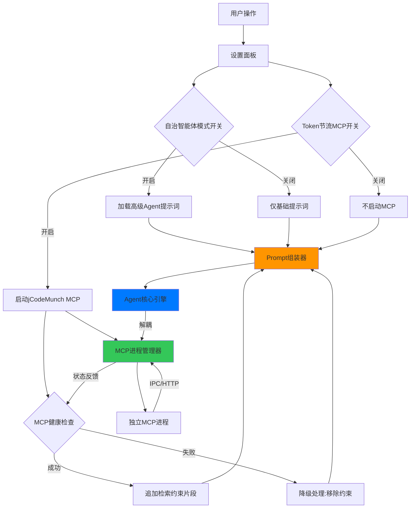
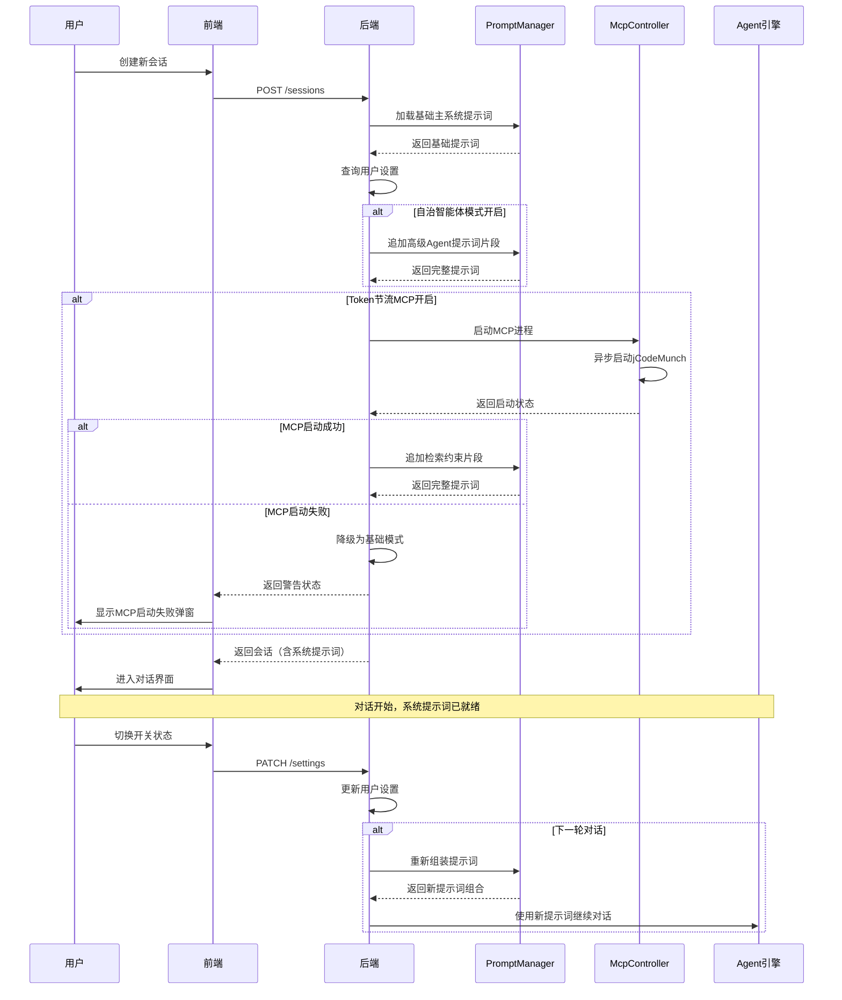

# Agent Mode & MCP Control System

Feature Name: agent-mode-mcp-control
Updated: 2026-07-28

## Description

本功能为 Climber 平台引入双独立开关控制系统，分别控制「自治智能体模式」与「Token 节流代码检索 MCP」，实现四种自由组合运行逻辑。基础主系统提示词永久常驻，节流约束仅作为附加片段动态追加；MCP 进程与 Agent 核心引擎解耦，确保单点故障不影响整体可用性。

## Architecture



## Components and Interfaces

### 1. PromptManager（提示词管理器）

**职责**: 管理基础主系统提示词与动态附加片段的组装

```python
class PromptManager:
    def __init__(self):
        self.base_prompt: str = ""
        self.autonomous_prompt: str = ""
        self.mcp_constraint_prompt: str = ""
    
    def assemble_prompt(self, autonomous_mode: bool, mcp_ready: bool) -> str:
        """组装最终系统提示词"""
        prompt = self.base_prompt
        if autonomous_mode:
            prompt += f"\n\n{self.autonomous_prompt}"
        if mcp_ready:
            prompt += f"\n\n{self.mcp_constraint_prompt}"
        return prompt
    
    def get_active_constraints(self) -> List[str]:
        """获取当前激活的约束片段列表"""
        pass
```

**接口文件**: `app/core/prompt_manager.py`

### 2. McpController（MCP 进程控制器）

**职责**: 管理 jCodeMunch MCP 进程的生命周期、健康检查、自动重启

```python
class McpController:
    def __init__(self, config: McpConfig):
        self.process: Optional[subprocess.Popen] = None
        self.config = config
        self.restart_count = 0
        self.max_restarts = 3
    
    async def start(self) -> bool:
        """启动 MCP 进程"""
        pass
    
    async def stop(self) -> None:
        """停止 MCP 进程"""
        pass
    
    async def health_check(self) -> HealthStatus:
        """健康检查"""
        pass
    
    async def restart(self) -> bool:
        """重启 MCP 进程（最多3次）"""
        pass
    
    def get_status(self) -> McpStatus:
        """获取当前状态"""
        pass
```

**接口文件**: `app/core/mcp_controller.py`

**与 Agent 解耦机制**:
- MCP 进程通过独立 HTTP 端口通信
- Agent 核心引擎通过 `McpController` 接口查询状态
- MCP 崩溃时 `McpController` 自动标记为失效，不抛出异常到 Agent
- Agent 检测到 `mcp_ready=False` 时自动降级

### 3. SettingsService（设置服务）

**职责**: 管理用户的双开关设置，持久化到数据库

```python
class SettingsService:
    def __init__(self, db: Session):
        self.db = db
    
    def get_settings(self, user_id: str) -> UserSettings:
        """获取用户设置"""
        pass
    
    def update_settings(self, user_id: str, settings: SettingsUpdate) -> UserSettings:
        """更新用户设置"""
        pass
    
    def get_effective_mode(self, user_id: str) -> EffectiveMode:
        """获取当前有效运行模式"""
        pass
```

**数据模型**:
```python
class UserSettings(Base):
    __tablename__ = "user_settings"
    
    id: str
    user_id: str
    autonomous_agent_mode: bool = False
    token_throttle_mcp_enabled: bool = False
    mcp_status: McpStatus = McpStatus.DISCONNECTED
    created_at: datetime
    updated_at: datetime
```

**接口文件**: `app/models/settings.py`, `app/services/settings_service.py`

### 4. Frontend Settings Page（前端设置页面）

**职责**: 提供双开关 UI，展示四种模式说明，处理 MCP 异常弹窗

```tsx
// src/pages/SettingsPage.tsx
export const SettingsPage: React.FC = () => {
  const [autonomousMode, setAutonomousMode] = useState(false);
  const [mcpEnabled, setMcpEnabled] = useState(false);
  const [mcpStatus, setMcpStatus] = useState<'idle' | 'starting' | 'ready' | 'error'>('idle');
  
  return (
    <div className="settings-page">
      <ToggleSwitch
        label="自治智能体模式"
        description="加载高级自主Agent提示词，解锁任务拆解、自动规划、持续执行能力"
        checked={autonomousMode}
        onChange={setAutonomousMode}
      />
      <ToggleSwitch
        label="Token节流｜代码定向检索MCP"
        description="启动jCodeMunch索引服务，强制AI优先检索代码片段，减少无效Token消耗"
        checked={mcpEnabled}
        onChange={setMcpEnabled}
        status={mcpStatus}
      />
      {mcpStatus === 'error' && (
        <ErrorDialog
          title="代码检索服务启动失败"
          message="MCP进程启动失败，对话功能仍可使用，代码检索能力暂时不可用"
          onClose={() => setMcpStatus('idle')}
        />
      )}
    </div>
  );
};
```

**前端 Hook**:
```tsx
// src/hooks/useAgentMode.ts
export function useAgentMode() {
  const [mode, setMode] = useState({ autonomous: false, mcp: false });
  
  const toggleAutonomous = async () => {
    const newMode = !mode.autonomous;
    await api.updateSettings({ autonomous_agent_mode: newMode });
    setMode(prev => ({ ...prev, autonomous: newMode }));
  };
  
  const toggleMcp = async () => {
    const newMode = !mode.mcp;
    await api.updateSettings({ token_throttle_mcp_enabled: newMode });
    setMode(prev => ({ ...prev, mcp: newMode }));
  };
  
  return { mode, toggleAutonomous, toggleMcp };
}
```

**接口文件**: `frontend-react/src/pages/SettingsPage.tsx`, `frontend-react/src/hooks/useAgentMode.ts`

### 5. ChatEngine Integration（会话引擎集成）

**职责**: 在会话创建和消息发送时，根据开关状态组装提示词

```python
class ChatEngine:
    def __init__(
        self,
        prompt_manager: PromptManager,
        mcp_controller: McpController,
        settings_service: SettingsService
    ):
        self.prompt_manager = prompt_manager
        self.mcp_controller = mcp_controller
        self.settings_service = settings_service
    
    async def create_session(self, user_id: str) -> Session:
        """创建新会话，加载基础提示词"""
        settings = self.settings_service.get_settings(user_id)
        system_prompt = self.prompt_manager.assemble_prompt(
            autonomous_mode=settings.autonomous_agent_mode,
            mcp_ready=settings.mcp_status == McpStatus.READY
        )
        return Session(system_prompt=system_prompt, ...)
    
    async def send_message(self, session: Session, message: str) -> Response:
        """发送消息，动态检查开关状态"""
        settings = self.settings_service.get_settings(session.user_id)
        mcp_ready = self.mcp_controller.get_status() == McpStatus.READY
        
        # 动态组装提示词（支持运行时切换）
        system_prompt = self.prompt_manager.assemble_prompt(
            autonomous_mode=settings.autonomous_agent_mode,
            mcp_ready=mcp_ready
        )
        
        return await self.agent.act(system_prompt, message)
```

**接口文件**: `app/core/chat_engine.py`

## Data Models

### UserSettings（用户设置）

```python
class UserSettings(Base):
    __tablename__ = "user_settings"
    
    id: Mapped[str] = mapped_column(String(36), primary_key=True)
    user_id: Mapped[str] = mapped_column(String(36), index=True)
    autonomous_agent_mode: Mapped[bool] = mapped_column(Boolean, default=False)
    token_throttle_mcp_enabled: Mapped[bool] = mapped_column(Boolean, default=False)
    mcp_status: Mapped[McpStatus] = mapped_column(Enum(McpStatus), default=McpStatus.DISCONNECTED)
    created_at: Mapped[datetime] = mapped_column(DateTime, default=datetime.utcnow)
    updated_at: Mapped[datetime] = mapped_column(DateTime, default=datetime.utcnow, onupdate=datetime.utcnow)
```

### McpStatus（MCP 状态枚举）

```python
class McpStatus(str, Enum):
    DISCONNECTED = "disconnected"
    STARTING = "starting"
    READY = "ready"
    ERROR = "error"
    RESTARTING = "restarting"
```

## Correctness Properties

1. **基础提示词不变性**: 基础主系统提示词在整个会话生命周期内保持不变，附加片段仅动态追加/移除
2. **开关独立性**: 两个开关的状态变化互不影响，切换一个开关不会触发另一个开关的状态变更
3. **MCP 故障隔离**: MCP 进程的任何异常（启动失败、崩溃、超时）不会传播到 Agent 核心引擎
4. **降级可用性**: 当 MCP 失效时，系统必须降级为基础提示词模式，保持对话功能可用
5. **重启次数限制**: MCP 自动重启次数不超过 3 次，超过后标记为永久失效

## Error Handling

### 1. MCP 启动失败

```python
async def start_mcp_with_fallback(self) -> McpStartResult:
    try:
        result = await asyncio.wait_for(self.mcp_controller.start(), timeout=10.0)
        return McpStartResult(success=True, status=McpStatus.READY)
    except asyncio.TimeoutError:
        return McpStartResult(
            success=False,
            status=McpStatus.ERROR,
            error="MCP 启动超时（10秒）",
            fallback="已降级为基础模式，对话功能正常"
        )
    except Exception as e:
        return McpStartResult(
            success=False,
            status=McpStatus.ERROR,
            error=f"MCP 启动失败: {str(e)}",
            fallback="已降级为基础模式，对话功能正常"
        )
```

**前端弹窗**:
- 标题: "代码检索服务启动失败"
- 内容: "MCP 进程启动失败，对话功能仍可使用，代码检索能力暂时不可用"
- 操作: 确定按钮关闭弹窗，开关保持开启但显示警告状态

### 2. MCP 运行中崩溃

```python
async def monitor_mcp_health(self):
    """后台监控 MCP 健康状态"""
    while True:
        await asyncio.sleep(5)
        status = await self.mcp_controller.health_check()
        
        if status == McpStatus.ERROR:
            if self.restart_count < self.max_restarts:
                self.restart_count += 1
                await self.mcp_controller.restart()
            else:
                # 标记为永久失效，通知前端
                await self.settings_service.update_mcp_status(
                    self.user_id, McpStatus.ERROR
                )
                await self.notification_service.send(
                    title="代码检索服务已停止",
                    message="MCP 进程多次重启失败，已自动禁用，不影响对话使用"
                )
```

### 3. 提示词组装失败

```python
def assemble_prompt_safe(self, autonomous_mode: bool, mcp_ready: bool) -> str:
    """安全组装提示词，任何片段失败都降级为基础提示词"""
    try:
        prompt = self.base_prompt
        if autonomous_mode:
            prompt += f"\n\n{self.autonomous_prompt}"
        if mcp_ready:
            prompt += f"\n\n{self.mcp_constraint_prompt}"
        return prompt
    except Exception:
        # 任何错误都降级为基础提示词
        return self.base_prompt
```

## Test Strategy

### 1. 单元测试

- **PromptManager**: 测试四种组合的提示词组装，验证基础提示词不变性
- **McpController**: 测试启动/停止/重启/健康检查，验证重启次数限制
- **SettingsService**: 测试开关状态读写，验证独立性

### 2. 集成测试

- **端到端流程**: 创建会话 -> 切换开关 -> 发送消息 -> 验证提示词组合
- **MCP 故障注入**: 模拟 MCP 启动失败，验证降级逻辑
- **开关联动测试**: 验证切换一个开关不影响另一个

### 3. 前端测试

- **UI 渲染**: 测试双开关在不同屏幕尺寸下的布局
- **交互测试**: 测试开关切换动画、状态同步
- **弹窗测试**: 测试 MCP 错误弹窗显示与关闭

## Module Loading Sequence



## Code Layering

```
frontend-react/src/
├── pages/
│   └── SettingsPage.tsx          # 设置面板主页面
├── hooks/
│   ├── useAgentMode.ts           # 自治智能体模式Hook
│   └── useMcpControl.ts          # MCP控制Hook
└── components/
    └── settings/
        ├── ToggleSwitch.tsx      # 通用开关组件
        └── McpStatusBadge.tsx    # MCP状态徽章

agent-engine/
├── app/
│   ├── core/
│   │   ├── prompt_manager.py     # 提示词管理器
│   │   ├── mcp_controller.py     # MCP进程控制器
│   │   └── chat_engine.py        # 会话引擎（集成双开关逻辑）
│   ├── models/
│   │   └── settings.py           # 用户设置数据模型
│   ├── services/
│   │   └── settings_service.py   # 设置业务逻辑
│   └── api/v1/
│       └── settings.py           # 设置API端点
```

## References

- [MonkeyCode](https://github.com/monkeycodeai/monkeycode) - 功能模块耦合问题教训
- [Climber](https://github.com/climber-ai/climber) - 本地Agent架构参考
- [Cursor](https://cursor.sh) - 附加提示动态注入 + 本地代码索引
- [jCodeMunch MCP](https://github.com/jgravelle/jcodemunch-mcp) - 代码定向检索MCP服务
- [Leaked LLM Prompts](https://github.com/Eversmile12/leaked-llm-prompts) - 高级Agent提示词参考
- [System Prompts Leaks](https://github.com/asgeirtj/system_prompts_leaks) - 精简系统提示词集合
