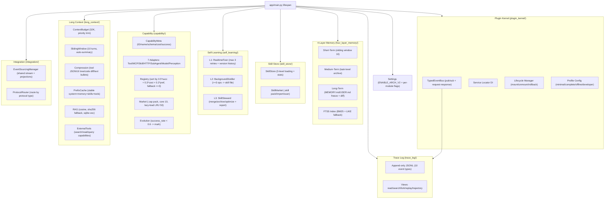

# Architecture v2 Core — Technical Design

Feature Name: architecture-v2-core
Updated: 2026-08-29

## Description

Ten architecture modules that together form the v2 core of the agent runtime, implementing the specification from the "10 architecture supplement documents". All modules are independently togglable via per-module switches behind a master `ENABLE_ARCH_V2` gate. When all switches are OFF, the system runs in pure v1 mode with no v2 code paths active.

## Architecture

## Module Details

### 1. Plugin Kernel (`app/core/plugin_kernel/`)

The kernel does exactly three things: lifecycle management, dependency injection, and typed event bus. Core components are themselves plugins; the kernel has no privileged hard-coded core other than lifecycle/DI/event plumbing.

- `Plugin` base class with `id`/`version`/`dependencies` class attributes and `on_mount`/`on_unmount` hooks.
- `PluginContext` handed at mount time: provides `get_service`, `register_service`, `subscribe`, `emit`, `request`, `register_request_handler`.
- `PluginKernel` container: `register`/`mount`/`unmount`/`shutdown`. Unmount reverses all registrations (no orphans). Supports cascading unmount.
- `TypedEventBus`: subscribe/publish (fire-and-forget broadcast) and request/response (caller awaits reply). Optional trace_sink receives every published event.
- `ProfileConfig`: mode (minimal/complete/offline/developer) + overrides + disabled_plugins. `resolve()` computes effective plugin list.

### 2. Trace Log (`app/core/trace_log/trace_log.py`)

Append-only JSONL event log, one file per session, rotated at configurable size.

- 10 event type constants: `EVENT_SYSTEM_PROMPT`, `EVENT_REASONING`, `EVENT_TOOL_CALL`, `EVENT_TOOL_RESULT`, `EVENT_SCREENSHOT`, `EVENT_DECISION`, `EVENT_MODEL_SWITCH`, `EVENT_SUBAGENT`, `EVENT_CONTEXT_INJECTION`, `EVENT_SKILL_LOAD`.
- `TraceLog.append(event_type, data, session_id)` writes a TimeCapsule to the session's JSONL file.
- `read(session_id, start_sequence, event_type, limit)` — reads events from the session's file.
- `search(session_id, query)` — grep in tool_results and decision payloads.
- `fork(source_session, after_sequence, new_session_id)` — copies events after a sequence to a new session.
- `replay(session_id, handler)` — re-dispatches events to a handler.
- `trajectory(session_id, event_type)` — timeline summary view.

### 3. Four-Layer Memory (`app/core/four_layer_memory/`)

- **ShortTermMemory**: `dataclass` with `window_size=10` and `turns: list[Turn]`. `add(role, content)` appends and trims window; `evicted()` returns evicted turns for summarization; `drain_evicted()` clears evicted list.
- **MediumTermMemory**: `begin_task(title)` returns task_id; `add_record(operation, ...)` appends to active task; `finish_task()` archives and optionally promotes to long-term.
- **LongTermMemory**: `base_dir` containing MEMORY.md and USER.md. `freeze()` reads both files; `propose_change(path, content)` generates a diff; `apply_change(change)` writes if approved; `approve()` / `reject()`.
- **FTS5Index**: `add_document(path, content)` upserts into SQLite FTS5 virtual table; `search(query, limit)` returns BM25-ranked results; `LIKE` fallback when FTS5 query syntax errors.

### 4. Skill Store (`app/core/skill_store/`)

- **SkillStore**: `base_dir` with subdirectories per skill, each containing `metadata.json` and optional `skill.md`/`references/`. `list_skills()` reads metadata dirs; `get_skill(name)` loads content on-demand; `get_skill_safe(name)` returns None on error; `save_skill(name, metadata, content, references)` writes; `delete_skill(name)`.
- Usage tracking: `record_usage(name, success, duration_ms)` updates in-memory stats; `list_skills()` returns skills with stats; `get_usage_stats()`.
- **SkillMarket**: `package_skill(name, output_path)` creates .skill zip; `scan_skill(path)` inspects permissions; `install_skill(path)` requires user authorization.

### 5. Self-Learning (`app/core/self_learning/`)

- **L1 RealtimeFixer**: `fix_skill(name, error)` loads skill file, applies one of 3 strategies (coordinate normalization, element validation, general step clarification), saves with version history (FixRecord). Max 3 retries.
- **L2 BackgroundDistiller**: `distill(operations, result)` — converts successful multi-step traces into skill files with name/description/trigger/steps/notes. Only triggers when >=3 operations AND non-generic verbs present.
- **L3 SkillSteward**: `run()` reviews all skills: merges duplicates (by similar description), archives skills unused >30 days, updates stale descriptions, marks success_rate<60% skills as needs_optimization for L1 queue. Generates rollbackable StewardReport.

### 6. Capability Abstraction (`app/core/capability/`)

- **CapabilityMeta**: `id`/`name`/`description`/`type`/`input_schema`/`output_schema`/`cost_profile` (avg_ms/token_estimate/money_estimate)/`success_rate`/`preconditions`/`side_effects`/`executable_check`.
- **WrappedCapability**: wraps a callable as a capability with the meta.
- **Adapters**: `McpAdapter`, `SkillAdapter`, `HttpAdapter`, `SubAgentAdapter`, `ModelAdapter`, `PerceptionAdapter` — each wraps its respective backend.
- **CapabilityRegistry**: `register(capability)` stores; `resolve(capability_id, context)` returns sorted implementations by `success_rate*0.5 + cost*0.3 + preference*0.2`; `execute(capability_id, input, context)` calls resolve then tries each with fallback (max 3).
- **CapabilityMarket**: package as .cap zip; scan for suspicious permissions; install with authorization. Loads only core 10 at startup, lazy-loads rest with LRU capacity 50.
- **Evolution**: `evaluate_capability(cap)` checks success_rate < 0.6, marks for optimization.

### 7. Long Context (`app/core/long_context/`)

- **ContextBudget**: `total=32768` tokens. `allocate(components)` computes total and trims lowest-priority components first. Priority order: `tool_results > recent_turns > rag_results > history_summary > skill_index > long_term_memory`.
- **SlidingWindow**: `window_size=10`. `add(role, content)` appends, evicts oldest, optionally triggers summary every 5 evictions via `summarize_fn`.
- **CompressionPipeline**: `_compress_tool_result(dict)` -> single-line JSON; `_compress_code(text)` -> first 200 + last 200 + "truncated N lines"; `_compress_ui_tree(list)` -> filter visible + interactive only; `_compress_text(text)` -> bullet points.
- **PrefixCache**: `set_fixed(system, memory, skills, tools)` then `render_fixed_prefix()` in canonical order. `assemble(dynamic)` builds full prompt.
- **RAGIndex**: `add_documents(docs)` embeds and stores; `search(query, k)` returns cosine-similarity-ranked results. Falls back to sha256 hashing when no `embed_fn`.
- **ExternalTools**: `search_memory`, `read_skill`, `get_task_history`, `query_log`, `get_app_state` — tool stubs for context retrieval.

### 8. Integration Layer (`app/core/integration/`)

- **EventSourcingManager**: shared event stream (`_events: list[dict]`). `register_store(store)` shares the stream; `emit(event_type, data)` appends; `snapshot()` returns all store projections.
- **EventSourcedStore**: `name` + `apply(event, state)` pure function. `project()` rebuilds state from events; `project(upto=N)` time-travel queries.
- **ProtocolRouter**: `route(protocol, request)` dispatches to the appropriate handler. Default mappings: `http -> httpx`, `mcp -> MCP client`, `skill -> SkillStore`, `capability -> CapabilityRegistry`, `file -> pathlib`.

### 9. Wiring (`app/main.py`)

`_init_arch_v2()` async function, called from lifespan after `_init_fourth_gen()`. Returns dict of handles. `_stop_arch_v2()` shuts down PluginKernel first, then cleans up. Both are no-ops when master switch is OFF.

## Test Strategy

- 8 test files: `test_plugin_kernel.py`, `test_trace_log.py`, `test_four_layer_memory.py`, `test_skill_store.py`, `test_self_learning.py`, `test_capability.py`, `test_long_context.py`, `test_integration_layer.py`.
- Each test file covers the primary module API and edge cases.
- Tests use `pytest` + `pytest-asyncio` for async tests.
- No external dependencies beyond the project's existing test infrastructure.