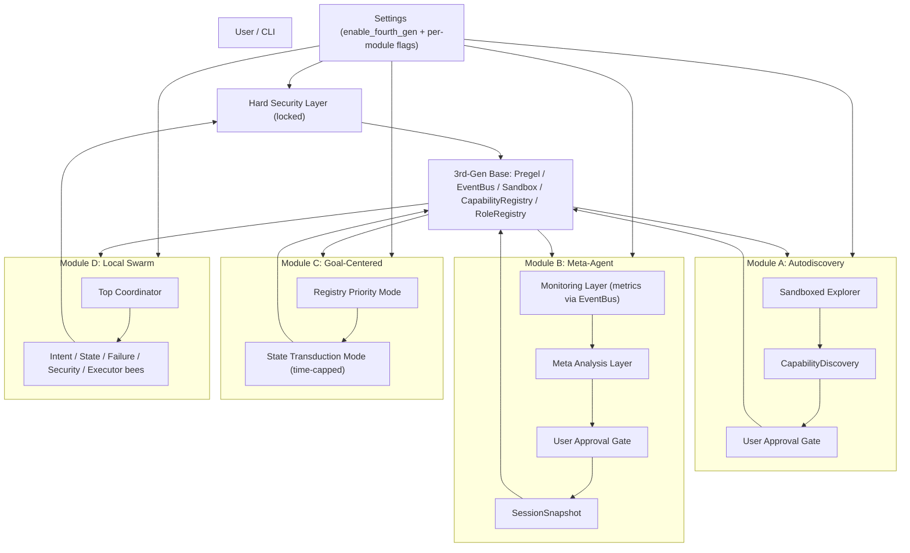

# Fourth-Generation Emergent Modules — Technical Design

Feature Name: fourth-gen-emergent-modules
Updated: 2026-08-29

## Description

Four optional emergent modules (Autodiscovery, Meta-Agent, Goal-Centered transduction, Local Swarm) layered on top of the existing third-generation unified capability platform. All four modules are disabled by default, controlled by a global switch plus per-module switches, and share a hard security layer plus snapshot/rollback. When all switches are OFF, the system runs in pure third-generation mode.

This design maps each requirement to existing modules and introduces minimal new code. It deliberately avoids a full fourth-generation takeover: the third-generation base (Pregel graph executor, EventBus, Sandbox, CapabilityRegistry) remains the stable product body.

## Architecture



### Architecture Explanation

- **Settings** gate all modules. The `Settings` class (`app/config.py`) gains `enable_fourth_gen` (global) plus `enable_autodiscovery`, `enable_meta_agent`, `enable_goal_centered`, `enable_swarm` (per-module). All default `False`.
- **Hard Security Layer**: reuse the existing immutable primitives — `EventBus` (`app/core/event_bus.py`), `SandboxExecutor` (`app/core/sandbox.py`), and a new `HighRiskActionGuard` singleton that is not importable/mutable from any module. Snapshot/rollback reuses `SessionSnapshotManager` (`app/core/session_snapshot.py`) plus a new registry snapshot.
- **Module A** reuses `CapabilityDiscovery` (`app/core/metacognition/capability_discovery.py`) but adds a sandboxed exploration loop and a user-approval gate before `_save()` to the registry.
- **Module B** adds a monitoring collector that subscribes to existing `EventBus` events and a meta-analysis layer producing graph-diff proposals; proposals only apply after user approval and after snapshot.
- **Module C** adds a state-transduction planner that is only invoked when the registry lookup misses; it is time-capped and falls back to the traditional tool path.
- **Module D** adds a coordinator + bee framework over `EventBus` broadcast; bees are single-responsibility and dynamically activated.

## Components and Interfaces

### Settings (config)

New fields in `app/config.py`:

```python
enable_fourth_gen: bool = Field(default=False)      # global master switch
enable_autodiscovery: bool = Field(default=False)   # module A
enable_meta_agent: bool = Field(default=False)      # module B
enable_goal_centered: bool = Field(default=False)   # module C
enable_swarm: bool = Field(default=False)           # module D
```

A module is active only when `enable_fourth_gen and <per_module>`.

### Hard Security Layer (`app/core/security/hard_guard.py` — new)

```python
class HighRiskActionGuard:
    """Immutable high-risk action blocker. Cannot be modified by any module."""
    HIGH_RISK_PATTERNS = ("batch_click", "delete_file", "bulk_network", "rm -rf")
    async def assert_allowed(self, action: str, payload: dict) -> None: ...
```

- Instantiated once as a module-level singleton (`hard_guard`).
- Not injected into Meta-Agent; Meta-Agent proposals are filtered by the guard before application.
- `EventBus` and `SandboxExecutor` are imported by reference and never swapped.

### Module A: Autodiscovery (`app/core/emergent/autodiscovery.py` — new)

```python
@dataclass
class AutodiscoveryConfig:
    enabled: bool = False
    sandbox_steps_max: int = 50
    success_threshold: float = 0.8
    approval_required: bool = True

class AutodiscoveryEngine:
    def __init__(self, sandbox: SandboxExecutor, discovery: CapabilityDiscovery,
                 config: AutodiscoveryConfig, bus: EventBus): ...
    async def explore(self, goal: str, primitives: list[str]) -> list[DiscoveredCapability]: ...
    async def request_approval(self, capability: ComposedCapability) -> bool: ...
    async def commit(self, capability: ComposedCapability) -> None: ...  # after approval + snapshot
```

- Exploration runs only in `SandboxExecutor`, never on the real device.
- `CapabilityDiscovery.discover()` composes the candidate; new candidates are gated.
- On commit: `session_snapshot_manager.create_snapshot(...)` → registry save → `EventBus.publish("capability_committed", ...)`.

### Module B: Meta-Agent (`app/core/emergent/meta_agent.py` — new)

```python
@dataclass
class MetaProposal:
    summary: str
    graph_diff: dict
    applied: bool = False

class MetaAgent:
    def __init__(self, bus: EventBus, snapshot: SessionSnapshotManager, config): ...
    async def start_monitoring(self) -> None: ...   # subscribes to metric events
    async def analyze(self) -> list[MetaProposal]:  # deadlock/token/timeout detection
    async def propose(self, proposal: MetaProposal) -> MetaProposal: ...
    async def apply(self, proposal: MetaProposal) -> None: ...
    async def rollback(self, snapshot_id: str) -> None: ...
```

- Metrics already emitted by the third-gen engine (`tool_result`, `node_end`, `iteration_*`, `session_complete`). The monitoring layer consumes these via `bus.subscribe`.
- Proposals are never applied automatically: `propose()` notifies the user and awaits approval.
- `apply()` first snapshots, then mutates the graph definition, then verifies via the hard guard.

### Module C: Goal-Centered (`app/core/emergent/goal_centered.py` — new)

```python
@dataclass
class GoalState:
    target: dict

class GoalCenteredPlanner:
    def __init__(self, bus: EventBus, config, registry_capabilities): ...
    async def plan(self, current: dict, goal: GoalState,
                   *, max_seconds: float = 10.0) -> list[PlanStep] | None: ...
    async def try_registry_first(self, goal: str) -> ComposedCapability | None: ...
```

- Priority mode: `try_registry_first()` queries the Capability Registry.
- Transduction mode: bounded search over atomic primitive sequences (`max_seconds` cap); on timeout, returns `None` and the caller falls back to the traditional tool path.
- Successful transductions are cached back into the registry as new capabilities.

### Module D: Local Swarm (`app/core/emergent/swarm.py` — new)

```python
class SwarmBee(Protocol):
    name: str
    async def handle(self, task: dict, bus: EventBus) -> dict: ...

class SwarmCoordinator:
    def __init__(self, bus: EventBus, bees: list[SwarmBee], config): ...
    async def run_subtask(self, subtask: dict) -> dict: ...
    async def activate(self, load: int) -> None: ...   # dynamic activation
```

- Coordinator always exists; bees communicate only via `bus.publish`/`subscribe`.
- Bees: intent parser, state validator, failure reviewer, security checker, device executor.
- Dynamic activation: coordinator tracks load and activates/sleeps bees; crashed bees are detected via missing responses and handled as degraded state.

### Wiring (`app/main.py`)

- In `lifespan()` startup: if `enable_fourth_gen`, instantiate active modules and start their background loops (e.g., `meta_agent.start_monitoring()`).
- On shutdown: stop module loops before `watchdog.stop()`.

## Data Models

- `DiscoveredCapability` (new, `app/core/emergent/autodiscovery.py`): wraps `ComposedCapability` + exploration metadata (attempts, success_count, success_rate, source_sandbox).
- `MetaProposal` (new): summary, `graph_diff`, applied flag, snapshot_id.
- `GoalState` (new): target conditions dict.
- `PlanStep` (new): atomic primitive name + params.
- Reuse: `ComposedCapability` (`app/core/metacognition/capability_discovery.py`), `SessionSnapshot` (`app/core/session_snapshot.py`), `RunRecord`/`RunEvent` (unified run protocol).
- Snapshot includes: registry dump, graph definitions, switch states, config. Stored via `SessionSnapshotManager` and a `snapshots/{ts}.json` sidecar.

## Correctness Properties

1. **Isolation**: Module A cannot affect Module B's graph; Module B cannot alter other modules' switches/config (enforced by the hard guard + snapshot filter).
2. **No auto-apply**: All capability additions and graph modifications require explicit user approval (Requirements 3.5, 4.5).
3. **Termination**: Exploration capped by `sandbox_steps_max`; transduction capped by `max_seconds`.
4. **Fallback**: Registry miss + transduction timeout → traditional tool path (Requirement 5.6).
5. **Decentralization boundary**: Coordinator always present; bees never self-schedule beyond their subtask scope (Requirement 6.1).
6. **Hard-layer immutability**: High-risk patterns and event bus/sandbox are not mutable from any fourth-gen module (Requirements 2.2, 4.9).

## Error Handling

| Scenario | Handling |
|---|---|
| Sandbox exploration crashes | Log, discard candidate, continue to next primitive sequence |
| Discovered capability success rate below threshold | Discard silently (Requirement 3.8) |
| User rejects approval | Discard proposal/capability (Requirements 3.7, 4.7) |
| Transduction timeout | Return `None` → caller falls back to traditional tool path |
| Bee crash | Coordinator treats result as degraded, retries once, then continues |
| Meta-proposal applied and system degrades | One-click rollback to pre-change snapshot |
| Snapshot creation fails before structural change | Abort the change (no change without snapshot) |

## Test Strategy

- **Unit tests**: `tests/test_emergent_autodiscovery.py` (sandbox-only exploration, threshold gating, approval gate, discard path); `tests/test_emergent_meta_agent.py` (metric collection, proposal generation, approval-only apply, rollback); `tests/test_emergent_goal_centered.py` (registry-first, transduction cap/fallback, caching); `tests/test_emergent_swarm.py` (coordinator present, bee isolation, crash degradation, dynamic activation).
- **Hard guard tests**: `tests/test_hard_guard.py` (high-risk actions always blocked, immutability, snapshot-before-change invariant).
- **Settings tests**: `tests/test_fourth_gen_switches.py` (default OFF, master+per-module gating, runtime toggle).
- **Integration**: extend `tests/test_integration.py` with one test that enables all modules and verifies fallback to third-gen mode works after disabling.

## References

[^1]: (Filename) - `app/core/metacognition/capability_discovery.py` — CapabilityDiscovery, ComposedCapability
[^2]: (Filename) - `app/core/event_bus.py` — EventBus pub/sub
[^3]: (Filename) - `app/core/sandbox.py` — SandboxExecutor
[^4]: (Filename) - `app/core/session_snapshot.py` — SessionSnapshotManager
[^5]: (Filename) - `app/core/collaboration/roles.py` — RoleRegistry
[^6]: (Filename) - `app/core/engine/pregel/` — StateGraph, PregelEngine, HITLManager
[^7]: (Filename) - `app/config.py` — Settings
