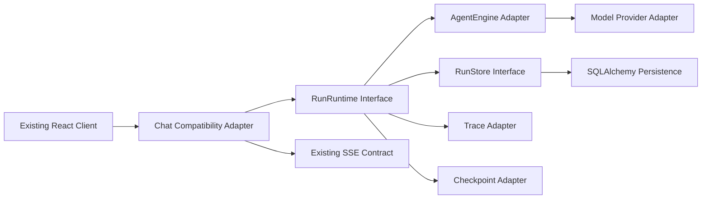
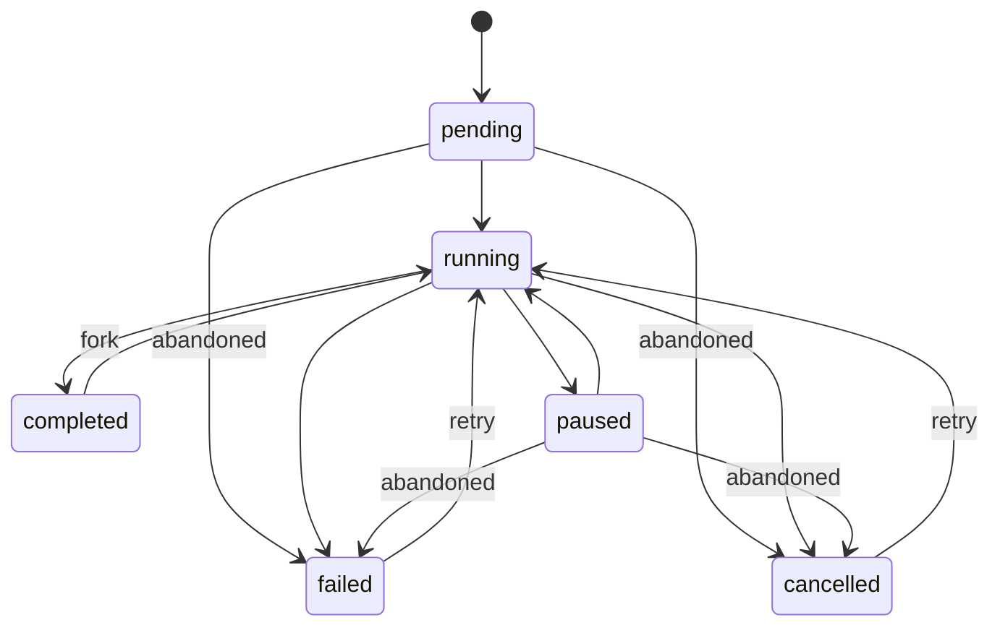

# 统一 Agent Run 协议

Feature Name: unified-agent-run-protocol
Updated: 2026-08-28

## 描述

本设计借鉴 PenguinHarness 的统一执行协议和消息保真原则，在 Climber 现有 Python/FastAPI/React 技术栈内建立统一 Run seam。首个垂直切片接入 Agent Chat，并通过兼容适配层维持现有 SSE 与 Session 接口。

现有 `Turn` 作为首个 Run 持久化骨架。设计通过增量字段和独立事件记录深化该模块，使 RunRuntime 统一拥有状态转换、消息关联、事件顺序、Trace 关联和 Checkpoint 关联。Workflow Run 与 Group Task 在后续切片通过 adapter 接入同一接口。

## 架构



`RunRuntime` 是外部 seam，首版接口保持小而深：

```python
class RunRuntime(Protocol):
    async def start(self, command: StartRun) -> RunHandle: ...
    async def stream(self, handle: RunHandle) -> AsyncIterator[RunEvent]: ...
    async def resume(self, command: ResumeRun) -> RunHandle: ...
    async def cancel(self, run_id: str, actor_id: str) -> RunState: ...
    async def replay(self, run_id: str, after: int = 0) -> ReplayPage: ...
```

调用方只需理解 Run 命令、RunHandle、RunEvent 和状态错误。数据库事务、序号分配、幂等写入、Trace、Checkpoint 和 Provider 载荷策略均位于模块实现内部。

## 组件与接口

### RunRuntime

职责：

- 创建 Run 并绑定 Session、Agent 和用户主体。
- 执行 Run 状态转换。
- 将 AgentEngine 输出标准化为 RunEvent。
- 协调 RunStore、Trace Adapter 和 Checkpoint Adapter。
- 在终态后执行 fencing。

### RunStore

RunRuntime 的内部持久化 seam，首版提供 SQLAlchemy adapter 和内存 fake。

```python
class RunStore(Protocol):
    async def create(self, run: RunRecord) -> RunRecord: ...
    async def transition(self, run_id: str, expected: RunStatus, target: RunStatus, values: dict) -> RunRecord: ...
    async def append_event(self, event: RunEvent) -> RunEvent: ...
    async def list_events(self, run_id: str, after: int, limit: int) -> ReplayPage: ...
    async def attach_checkpoint(self, run_id: str, checkpoint_id: str, iteration: int) -> None: ...
```

`transition` 和 `append_event` 在数据库层执行条件写入。事件唯一约束采用 `(run_id, event_id)`，顺序唯一约束采用 `(run_id, sequence)`。

### AgentEngine Adapter

职责：

- 将 StartRun 转换为现有 `AgentSession` 和用户消息。
- 将现有 `AgentEvent` 转换为统一 `RunEvent`。
- 保持现有工具审批、模型 fallback 和上下文压缩逻辑。
- 将 `run_id` 设置为现有 `current_turn_id`，让 Checkpoint ID 继续稳定生成。

### Chat Compatibility Adapter

职责：

- 保持 `POST /api/v1/sessions/{session_id}/chat` 请求契约。
- 将 RunEvent 映射为当前 SSE 事件名和 `data` 字段。
- 保持 replay 响应字段并增加 `run_id`。
- 在统一 Run API 稳定后继续作为旧客户端 adapter。

### Raw Payload Policy

配置：

- `RUN_RAW_PAYLOAD_POLICY=standard|debug`
- `RUN_RAW_PAYLOAD_RETENTION_DAYS`
- `RUN_RAW_PAYLOAD_MAX_BYTES`

`standard` 保存 Provider、model、finish reason、usage、tool call 标准字段及哈希摘要。`debug` 保存经过脱敏和加密的完整载荷，并记录 `expires_at`。过期任务将完整载荷转换为摘要状态。

## 数据模型

### RunRecord

首个切片深化 `turns` 表：

| 字段 | 类型 | 说明 |
|---|---|---|
| `id` | UUID | `run_id`，兼容现有 `turn_id` |
| `session_id` | UUID | 所属 Session |
| `user_id` | UUID | 资源主体，用于归属查询 |
| `agent_id` | UUID nullable | 执行 Agent |
| `kind` | string | 首版固定为 `agent_chat` |
| `status` | string | Run 状态 |
| `trace_id` | UUID nullable | 根 Trace |
| `checkpoint_id` | UUID nullable | 最新 Checkpoint |
| `last_sequence` | integer | 最后持久化事件序号 |
| `execution_token` | integer | 恢复与写入 fencing token |
| `started_at` | datetime | 开始时间 |
| `completed_at` | datetime nullable | 终态时间 |
| `metadata` | JSON | 兼容和扩展元数据 |

### MessageEnvelope

首个切片复用 `messages` 表，在 `metadata` 中保存 `run_id`、Provider 摘要和 schema version。后续依据查询量评估将 `run_id` 提升为索引列。

```python
@dataclass(frozen=True)
class MessageEnvelope:
    message_id: str
    run_id: str
    session_id: str
    role: MessageRole
    content: str
    created_at: datetime
    tool_call_id: str | None = None
    tool_name: str | None = None
    provider: str | None = None
    model_id: str | None = None
    raw_payload_ref: str | None = None
```

### RunEvent

新增 `run_events` 表，以持久化记录替代仅进程内的 EventReplayBuffer 作为权威回放源。EventReplayBuffer 可继续作为读取缓存。

```python
@dataclass(frozen=True)
class RunEvent:
    event_id: str
    run_id: str
    sequence: int
    event_type: str
    data: dict[str, Any]
    created_at: datetime
    trace_id: str | None = None
    checkpoint_id: str | None = None
```

### RawPayloadRecord

完整原始载荷采用独立记录，避免扩大常规 Message 与 Event 查询：

- `id`
- `run_id`
- `message_id`
- `provider`
- `payload_ciphertext`
- `payload_digest`
- `redaction_version`
- `expires_at`
- `created_at`

## 状态机



`retry` 创建新的 execution token，并保留同一 Run 的恢复语义。`fork` 在后续切片创建新 Run，并通过 `parent_run_id` 记录来源。

## 正确性属性

1. 同一 Run 的事件序号严格递增。
2. 同一 `event_id` 只产生一条持久化记录。
3. 终态 Run 只接受审计类附加记录。
4. Checkpoint 的 `session_id` 和 `run_id` 必须与恢复目标一致。
5. Trace 根 Span 的 `run_id` 必须与 RunRecord 一致。
6. SSE 实时事件和 replay 事件使用相同的持久化 RunEvent。
7. 旧 Chat 客户端可在迁移期间继续解析所有业务事件。
8. Provider 完整载荷持久化遵循配置、脱敏、加密和过期策略。

## 错误处理

| 场景 | 行为 |
|---|---|
| Session 不存在 | 返回 `404 session_not_found` |
| Session 归属不匹配 | 返回 `403 forbidden` |
| Session 已有活动 Run | 返回 SSE `error` 并附带 `run_conflict` 代码 |
| Run 状态转换冲突 | 返回 `409 run_state_conflict` |
| Checkpoint 关联不一致 | 返回 `409 checkpoint_scope_mismatch` |
| 事件重复写入 | 返回已有事件，保持幂等 |
| 原始载荷超过限制 | 保存摘要并记录 `payload_truncated` |
| Trace 写入失败 | Run 继续执行并记录可观测性降级事件 |
| Run 持久化失败 | 停止业务事件输出并将 Run 标记为失败 |

## 迁移顺序

1. 新增纯类型模块、状态机和内存 RunStore fake。
2. 新增 `run_events` 与 Turn 增量字段迁移。
3. 实现 SQLAlchemy RunStore 与条件状态转换。
4. 实现 AgentEngine Adapter，并让 `run_id` 复用 `current_turn_id`。
5. 将 Chat endpoint 切换到 RunRuntime，保留当前 SSE 映射。
6. 将 replay endpoint 切换到持久化 RunEvent。
7. 增加 Raw Payload Policy 的 `standard` 实现。
8. 在独立批次实现 `debug` 加密存储和过期转换。

## 测试策略

### 单元测试

- Run 状态转换表驱动测试。
- Message Envelope 序列化往返测试。
- AgentEvent 到 RunEvent 的映射测试。
- Compatibility Adapter SSE 快照字段测试。
- Raw Payload Policy 脱敏和截断测试。

### 集成测试

- Chat 请求创建 Run、Message、Trace 和 Checkpoint 关联。
- 实时 SSE 与 replay 返回相同事件标识和序号。
- 服务重建运行时对象后仍可从数据库回放。
- 并发 Chat 请求只创建一个活动 Run。
- 终态 fencing 和重复事件幂等写入。

### 回归测试

- 现有 AgentEngine 测试保持通过。
- 现有 Chat、Session、Checkpoint、Trace 和前端 useChat 测试保持通过。
- 前端生产构建和完整测试保持通过。

## 参考资料

[^1]: (PenguinHarness Repository) - 统一 OmniMessage、Core SDK、Trace 和文件层架构，https://github.com/Prism-Shadow/penguin-harness
[^2]: (app/core/agent_engine.py) - 当前 Agent Chat 执行、事件和 Checkpoint 链路。
[^3]: (app/storage/database.py) - 当前 Session、Turn、Message 和 Checkpoint 数据模型。
[^4]: (app/core/tracing.py) - 当前 Trace Span 持久化实现。
[^5]: (app/api/v1/chat.py) - 当前 Chat SSE 与 replay 兼容接口。
