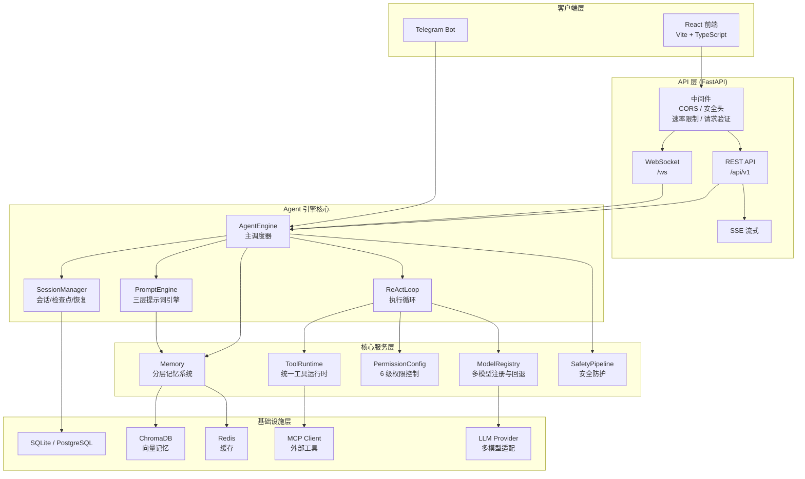

# Climber — 本地优先 AI Agent 工作台

[]()
[]()
[]()
[]()
[]()

> 本地优先、开源的 AI Agent 平台。无需注册登录，数据完全本地存储。

## 项目介绍

Climber 是一个生产级 AI Agent 工作台，支持自主软件开发、多 Agent 协作和工具扩展。系统采用分层架构设计，提供从模型调度、上下文管理到权限控制的全栈能力。所有数据默认存储在本地 SQLite，可选 PostgreSQL 用于多用户并发场景。

### 核心能力

| 能力 | 说明 |
|------|------|
| 分层记忆 | 记忆分块（核心/会话上下文/归档/实体/人格）+ 情节记忆衰减与自动归档，支持上下文压缩 |
| 多 Agent 协作 | 顺序/层级/群聊三种协作流程，依赖图死锁检测与检查点/恢复 |
| 工具系统 | 统一工具运行时，MCP 协议接入，安全沙箱隔离 |
| 模型调度 | 多模型注册（registry 按 `DEFAULT_MODEL_SPEC` 选择）+ 熔断/超时与降级回退 |
| 权限控制 | 6 级权限模式（默认/接受编辑/计划/自动/严格/绕过），危险命令与 Shell 注入拦截 |
| 会话持久化 | 检查点/恢复，断点续跑 |
| 安全加固 | 路径穿越防护、Shell 注入风险拦截、系统提示词注入保护 |
| 可观测性 | 结构化日志、JSON 指标、Token 用量追踪 |
| 科学仿真 Agent | 自然语言实验需求 → 仿真工具调度 → 收敛探针 + LLM 评审 → 自动调参/重规划 → JSONL 全链路账本；内置 heat/oscillator/logistic 数值实验后端开箱可跑，工业级求解器经 MCP 接入，不自研求解器 |
| 提示词管理 | 外部模板仓库加载（`app/core/prompt_engine/`） |

## 快速开始

### 前置要求

- Python 3.11+
- Node.js 18+
- pip / npm

### 后端启动

```bash
# 克隆仓库
git clone https://github.com/lyn2010526-stack/climber.git
cd climber

# 创建虚拟环境
python -m venv venv
source venv/bin/activate

# 安装依赖
pip install -r requirements.txt

# 数据库迁移
alembic upgrade head

# 启动服务
uvicorn app.main:app --host 0.0.0.0 --port 8000
```

### 前端启动

```bash
cd frontend-react
npm install
npm run dev
```

### Docker 启动

```bash
docker-compose up -d
```

### 访问地址

| 服务 | URL |
|------|-----|
| 前端界面 | http://localhost:5173 |
| 后端 API | http://localhost:8000 |
| API 文档 (Swagger) | http://localhost:8000/docs |
| 健康检查 | http://localhost:8000/health |
| 指标 | http://localhost:8000/metrics |

## 系统架构



## 核心模块

| 模块 | 路径 | 职责 |
|------|------|------|
| Agent Engine | `app/core/agent_engine.py` | 主引擎，协调所有组件 |
| 会话管理 | `app/core/engine/session.py` | 会话生命周期管理 |
| 提示词引擎 | `app/core/prompt_engine/` | 三层提示词引擎（模板/注入/模型适配） |
| 工具运行时 | `app/tools/` | 统一工具注册与执行 |
| MCP 桥接 | `app/core/mcp_controller.py` | MCP 工具协议接入 |
| 权限控制 | `app/core/permission_rules.py` | 权限规则引擎 |
| 模型注册 | `app/models/registry.py` | 多模型注册与选择 |
| 熔断降级 | `app/core/execution/circuit_breaker.py` | 超时管理、熔断与回退 |
| 安全工具 | `app/core/security/` | 路径隔离、沙箱、资源配额 |
| 多 Agent | `app/core/collaboration/` | 顺序/层级/群聊协作流程、死锁检测 |
| Crew/Flow 编排 | `app/multi_agent/` | Crew 编排与事件驱动 Flow |

## 配置说明

创建 `.env` 文件（参考 `.env.example`）：

```env
# API Keys（至少配置一个，通过环境变量读取）
ANTHROPIC_API_KEY=sk-ant-...
OPENAI_API_KEY=sk-...

# 数据库（默认 SQLite）
DATABASE_URL=sqlite+aiosqlite:///./data/climber.db

# 日志
APP_LOG_LEVEL=INFO

# 应用密钥（JWT 签名使用，必填且不可为空）
APP_SECRET_KEY=change-me-in-production

# 模型（registry 按 DEFAULT_MODEL_SPEC 读取，默认 gpt-4o）
DEFAULT_MODEL_SPEC=gpt-4o

# 向量库
VECTOR_STORE_PATH=./data/chroma
```

> 完整配置项见 `app/config.py` 的 `Settings` 类（`app_env`、`app_debug`、`trusted_proxies`、
> `cors_origins`、`jwt_algorithm`、`jwt_expire_minutes`、`redis_url`、`sqlite_wal` 等）。
> 未被 `Settings` 或代码中 `os.environ` 读取的变量会被 pydantic-settings 静默忽略。

## 文档

| 文档 | 描述 |
|------|------|
| [ARCHITECTURE.md](docs/ARCHITECTURE.md) | 系统架构、模块关系、数据流 |
| [API.md](docs/API.md) | 所有 API 端点详细说明 |
| [DEPLOYMENT.md](docs/DEPLOYMENT.md) | 部署指南（Docker、本地、云） |
| [DEVELOPMENT.md](docs/DEVELOPMENT.md) | 开发指南、代码规范、测试方法 |
| [SECURITY.md](docs/SECURITY.md) | 安全策略、已知风险、防护措施 |
| [SCIENCE_AGENT_REFERENCES.md](docs/SCIENCE_AGENT_REFERENCES.md) | 科学仿真 Agent 的 5 个开源参考实现与借鉴点 |

## 测试

```bash
# 后端测试
python3 -m pytest tests/ -v

# 前端测试
cd frontend-react
npm test

# E2E 测试
cd frontend-react
npm run test:e2e
```

## 贡献指南

详见 [CONTRIBUTING.md](CONTRIBUTING.md)。

## License

MIT
