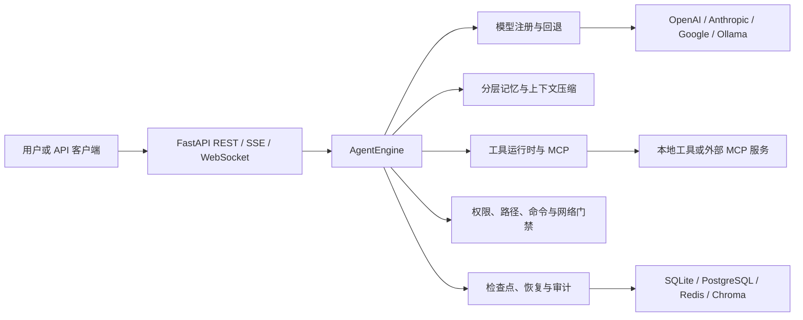

# Climber

**本地优先的 AI Agent 工作台，用于构建、运行和审计可恢复的 Agent 工作流。**

[](docs/TEST_REPORT.md)
[](https://www.python.org/)
[](https://fastapi.tiangolo.com/)
[](frontend-react/)
[](LICENSE)

Climber 把模型、工具、记忆、权限和多 Agent 编排放进一个可观察的运行时。它适合在本地开发 Agent，也适合把 Agent 能力嵌入需要检查点、恢复、权限边界和审计记录的内部自动化系统。

## 你可以用它做什么

- **开发助手**：让 Agent 阅读项目、调用工具、执行受控命令，并以会话和检查点保留上下文。
- **工作流自动化**：把多个 Agent 组织成顺序、层级或群聊协作流程，支持任务取消、失败恢复和运行记录。
- **工具扩展**：注册内置工具，接入 MCP 服务，使用统一的工具结果、超时、重试和错误脱敏机制。
- **本地知识工作台**：使用分层记忆、向量检索和上下文压缩，让长会话保持可用。
- **安全实验与集成**：通过权限模式、命令/路径校验、SSRF 防护、CSRF 防护和所有权检查，给 Agent 行为设置可验证的边界。

## 核心能力

| 领域 | 能力 | 对使用者的价值 |
| --- | --- | --- |
| Agent 运行时 | `AgentEngine`、ReAct 执行循环、模型注册与回退 | 统一管理模型调用、工具调用和会话生命周期 |
| 编排 | Workflow、Crew、Flow，以及顺序/层级/群聊协作 | 将单个 Agent 扩展为可追踪的多步骤任务 |
| 记忆 | 核心记忆、会话上下文、归档、实体、人格和情节记忆 | 支持长会话、上下文压缩和跨重启恢复 |
| 工具 | 内置工具、MCP Client、MCP Router、工具预算和超时 | 扩展外部能力，同时保留统一的执行边界 |
| 持久化 | SQLite 默认存储、PostgreSQL、多版本迁移、检查点 | 本地零依赖启动，也能迁移到多用户部署 |
| 安全 | 权限模式、命令/路径沙箱、SSRF、CSRF、认证和租户所有权 | 在工具执行前后验证请求和资源边界 |
| 可观测性 | Trace、审计记录、Prometheus 指标、Token 用量 | 定位 Agent 行为、成本和失败原因 |
| 交互界面 | React + Vite 前端、REST、SSE、WebSocket、Swagger | 从 UI、API 或实时流接入同一个运行时 |

## 工作方式


```mermaid
flowchart LR
    User["用户或 API 客户端"] --> API["FastAPI REST / SSE / WebSocket"]
    API --> Engine["AgentEngine"]
    Engine --> Model["模型注册与回退"]
    Engine --> Memory["分层记忆与上下文压缩"]
    Engine --> Tools["工具运行时与 MCP"]
    Engine --> Policy["权限、路径、命令与网络门禁"]
    Engine --> Checkpoint["检查点、恢复与审计"]
    Model --> Provider["OpenAI / Anthropic / Google / Ollama"]
    Tools --> External["本地工具或外部 MCP 服务"]
    Checkpoint --> Storage["SQLite / PostgreSQL / Redis / Chroma"]
```

一次 Agent 运行会经过模型选择、上下文组装、权限检查、工具执行和结果记录。需要长任务时，运行时可以保存检查点，在进程重启或任务恢复后继续工作。

## 快速开始

### 方式一：Docker Compose

适合第一次体验完整服务栈。Compose 文件会启动 API、React 前端、PostgreSQL 和 Redis；Chroma 作为向量存储服务保留在同一配置中。

```bash
git clone https://github.com/lyn2010526-stack/climber.git
cd climber

cp .env.example .env
# 编辑 .env，至少配置一个模型提供商和一个随机生成的 APP_SECRET_KEY
export POSTGRES_PASSWORD='replace-with-a-local-password'

docker compose up --build
```

启动后访问：

| 服务 | 地址 |
| --- | --- |
| Web 界面 | http://localhost:5173 |
| API | http://localhost:8000 |
| Swagger | http://localhost:8000/docs |
| OpenAPI JSON | http://localhost:8000/openapi.json |
| 健康检查 | http://localhost:8000/health |
| Prometheus 指标 | http://localhost:8000/metrics |

停止服务：

```bash
docker compose down
```

### 方式二：本地运行后端

适合后端开发、API 调试和运行 pytest。默认数据库是本地 SQLite，不需要先安装 PostgreSQL 或 Redis。

```bash
git clone https://github.com/lyn2010526-stack/climber.git
cd climber

python3 -m venv .venv
source .venv/bin/activate
pip install -r requirements.txt

cp .env.example .env
# 编辑 .env，配置 API key、APP_SECRET_KEY 和 CORS_ORIGINS
alembic upgrade head
uvicorn app.main:app --reload --port 8000
```

### 启动 React 前端

后端启动后，在另一个终端运行：

```bash
cd frontend-react
npm install
npm run dev
```

前端开发服务器默认运行在 `http://localhost:5173`。API 代理配置位于 Vite 配置中，前端请求使用 `/api` 前缀。

## 配置

配置从项目根目录的 `.env` 读取，完整占位符见 `.env.example`。

### 最小模型配置

至少配置一个模型提供商：

```env
OPENAI_API_KEY=<your-openai-key>
DEFAULT_MODEL_SPEC=gpt-4o-mini
```

也可以使用其他已接入的提供商：

```env
ANTHROPIC_API_KEY=<your-anthropic-key>
GOOGLE_API_KEY=<your-google-key>
OLLAMA_BASE_URL=http://localhost:11434
```

### 生产环境基础配置

```env
APP_ENV=production
APP_DEBUG=false
APP_SECRET_KEY=<random-value-at-least-16-characters>
ENABLE_AUTH=true
CORS_ORIGINS=https://your-frontend.example.com
CORS_ALLOW_CREDENTIALS=true
```

`APP_SECRET_KEY` 必须使用你自己的随机值。仓库中的示例值会被配置校验识别为占位符，不能用于生产签名。

### 存储选项

```env
# 默认：本地 SQLite
DATABASE_URL=sqlite+aiosqlite:///./data/climber.db

# 多用户并发部署可改用 PostgreSQL
DATABASE_URL=postgresql+asyncpg://<user>:<password>@<host>:5432/<database>

# 可选缓存和向量存储
REDIS_URL=redis://localhost:6379/0
VECTOR_STORE_PATH=./data/chroma
```

## 安全边界

Climber 把安全检查放在 Agent 执行路径中：

- 工具调用经过权限模式、工具预算、超时和重试控制。
- Shell 命令、文件路径和沙箱操作经过分类与校验。
- 外部 HTTP、浏览器导航和 MCP HTTP 端点经过 SSRF 校验，重定向目标也会重新检查。
- CSRF、Bearer Token、WebSocket 会话和资源所有权分别进行验证。
- 工具异常和结果会进行脱敏，避免把凭据或内部错误直接返回给客户端。
- 检查点和审计记录支持恢复、回放和问题定位。

安全配置依赖部署环境。生产部署必须使用随机 `APP_SECRET_KEY`、明确的 `CORS_ORIGINS`、真实的认证配置和受保护的数据库凭据。完整说明见 [`docs/SECURITY.md`](docs/SECURITY.md) 和 [`SECURITY_AUDIT_REPORT.md`](SECURITY_AUDIT_REPORT.md)。

## API 示例

### 创建会话并发送消息

```bash
curl -X POST http://localhost:8000/api/v1/sessions/ \
  -H 'Content-Type: application/json' \
  -d '{"title":"代码审查"}'
```

聊天接口通过 SSE 返回实时事件：

```text
data: {"type":"text","data":{"content":"..."}}
data: {"type":"tool_call","data":{"name":"...","arguments":{}}}
data: {"type":"done"}
```

完整端点、认证方式、请求体和事件格式见 [`docs/API.md`](docs/API.md)。交互式 API 文档启动后位于 `/docs`。

## 测试与质量

后端测试使用 pytest。共享测试数据库要求串行执行：

```bash
python3 -m pytest tests/ -q --timeout=120 -o addopts='' \
  -p no:cacheprovider --ignore=tests/integration
```

当前验证结果：`1088 passed, 1 warning, 18 subtests passed`。唯一 warning 来自 ChromaDB 第三方弃用提示。

Lint 和安全门禁：

```bash
python3 -m ruff check .
python3 -m ruff check app/ --select S,F,E9
python3 -m compileall -q app/ scripts/ alembic/
```

前端脚本位于 `frontend-react/package.json`：

```bash
npm run typecheck
npm run lint
npm test
npm run build
```

## 项目边界

Climber 当前聚焦 Agent 后端运行时和配套 Web 工作台。前端目录是独立的 React/Vite 应用；前端依赖、浏览器 E2E 和构建需要单独安装与验证。部分集成依赖（例如外部模型、Redis、PostgreSQL、MCP 服务）由部署配置决定，默认 SQLite 路径可在本地完成后端开发。

## 项目结构

| 目录 | 作用 |
| --- | --- |
| `app/core/` | Agent 引擎、会话、记忆、权限、恢复、安全门禁 |
| `app/api/` | FastAPI API 路由和请求响应契约 |
| `app/models/` | 模型适配器、注册表和领域模型 |
| `app/tools/` | 内置工具、MCP Client、MCP Router |
| `app/storage/` | SQLAlchemy 模型、数据库连接和持久化 |
| `app/multi_agent/` | Crew、Flow 和多 Agent 任务编排 |
| `alembic/` | 数据库迁移 |
| `frontend-react/` | React + Vite Web 界面 |
| `tests/` | 后端单元、API、安全和回归测试 |
| `docs/` | 架构、API、部署、安全和开发文档 |

## 文档入口

- [`docs/ARCHITECTURE.md`](docs/ARCHITECTURE.md)：模块关系和数据流
- [`docs/API.md`](docs/API.md)：API 端点、认证和 SSE 事件
- [`docs/DEPLOYMENT.md`](docs/DEPLOYMENT.md)：本地、Docker 和生产部署
- [`docs/DEVELOPMENT.md`](docs/DEVELOPMENT.md)：开发、测试和代码规范
- [`docs/SECURITY.md`](docs/SECURITY.md)：安全策略和配置前提
- [`AGENTS.md`](AGENTS.md)：仓库治理、文件边界和验证要求

## 许可证

MIT，见 [`LICENSE`](LICENSE)。
