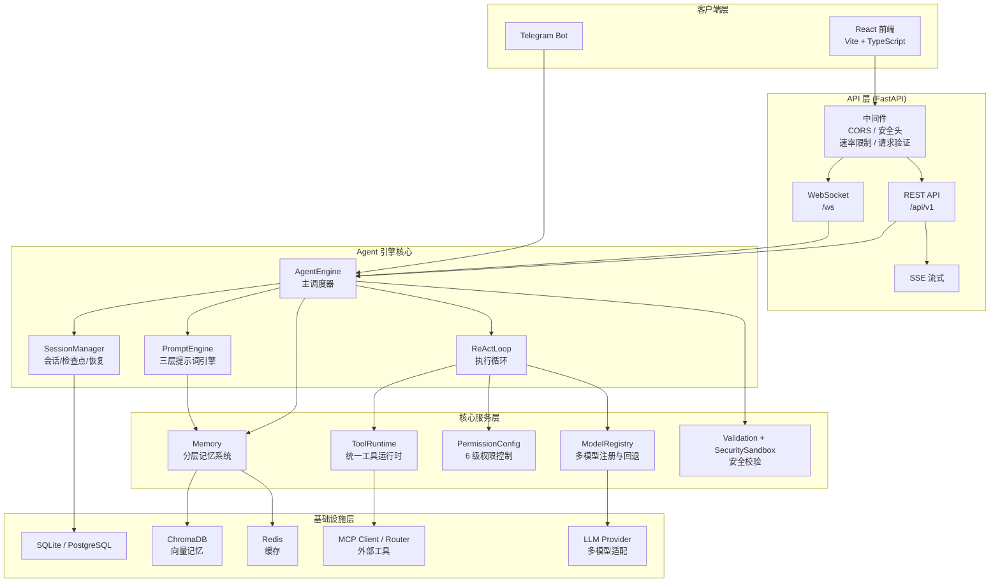

# Climber — 本地优先 AI Agent 工作台

[]()
[]()
[]()
[]()
[]()

> 本地优先、开源的 AI Agent 平台。无需注册登录，数据完全本地存储。

## 项目介绍

Climber 是一个生产级 AI Agent 工作台，支持自主软件开发、多 Agent 协作和工具扩展。系统采用分层架构设计，提供从模型调度、上下文管理到权限控制的全栈能力。所有数据默认存储在本地 SQLite，可选 PostgreSQL 用于多用户并发场景。

### 核心能力

| 能力 | 说明 |
|------|------|
| 分层记忆 | 记忆分块（核心/会话上下文/归档/实体/人格）+ 情节记忆衰减与自动归档，支持上下文压缩 |
| 多 Agent 协作 | 顺序/层级/群聊三种协作流程，依赖图死锁检测与检查点/恢复 |
| 工具系统 | 统一工具运行时，MCP 客户端/路由接入，安全沙箱隔离 |
| 模型调度 | 多模型注册（registry 按 `DEFAULT_MODEL_SPEC` 选择）+ 熔断/超时与降级回退 |
| 权限控制 | 6 级权限模式（默认/接受编辑/计划/自动/严格/绕过），危险命令与 Shell 注入拦截；生产认证需显式启用 |
| 会话持久化 | SQLite 检查点存储、会话恢复、回滚；工具结果回放按读/写/命令/网络分类 |
| 安全加固 | 工具输入校验、权限覆盖层、路径与命令沙箱校验、网络出口与 SSRF 门禁；任务进度 WebSocket 的认证仍待补齐 |
| 可观测性 | AgentEngine 写入 trace/audit，提供 observability API；Prometheus 指标与 Token 用量追踪 |
| 提示词管理 | 外部模板仓库加载（`app/core/prompt_engine/`） |

## 快速开始

### 前置要求

- Python 3.11+
- Node.js 18+
- pip / npm

### 后端启动

```bash
# 克隆仓库
git clone https://github.com/lyn2010526-stack/climber.git
cd climber

# 创建虚拟环境
python -m venv venv
source venv/bin/activate

# 安装依赖
pip install -r requirements.txt

# 数据库迁移
alembic upgrade head

# 启动服务
uvicorn app.main:app --host 0.0.0.0 --port 8000
```

### 前端启动

```bash
cd frontend-react
npm install
npm run dev
```

### Docker 启动

```bash
docker-compose up -d
```

### 访问地址

| 服务 | URL |
|------|-----|
| 前端界面 | http://localhost:5173 |
| 后端 API | http://localhost:8000 |
| API 文档 (Swagger) | http://localhost:8000/docs |
| 健康检查 | http://localhost:8000/health |
| 指标 | http://localhost:8000/metrics |

## 系统架构


```mermaid
flowchart TB
    subgraph Client["客户端层"]
        Frontend["React 前端\nVite + TypeScript"]
        Telegram["Telegram Bot"]
    end

    subgraph API["API 层 (FastAPI)"]
        REST["REST API\n/api/v1"]
        WS["WebSocket\n/ws"]
        SSE["SSE 流式"]
        Middleware["中间件\nCORS / 安全头\n速率限制 / 请求验证"]
    end

    subgraph AgentEngine["Agent 引擎核心"]
        Engine["AgentEngine\n主调度器"]
        SessionMgr["SessionManager\n会话/检查点/恢复"]
        PromptEngine["PromptEngine\n三层提示词引擎"]
        ReactLoop["ReActLoop\n执行循环"]
    end

    subgraph CoreServices["核心服务层"]
        ModelReg["ModelRegistry\n多模型注册与回退"]
        ToolRT["ToolRuntime\n统一工具运行时"]
        PermCfg["PermissionConfig\n6 级权限控制"]
        Memory["Memory\n分层记忆系统"]
        Safety["Validation + SecuritySandbox\n安全校验"]
    end

    subgraph Infra["基础设施层"]
        DB["SQLite / PostgreSQL"]
        Chroma["ChromaDB\n向量记忆"]
        Redis["Redis\n缓存"]
        MCP["MCP Client / Router\n外部工具"]
        LLM["LLM Provider\n多模型适配"]
    end

    Frontend --> Middleware
    Telegram --> Engine
    Middleware --> REST
    Middleware --> WS
    REST --> SSE
    REST --> Engine
    WS --> Engine
    Engine --> SessionMgr
    Engine --> PromptEngine
    Engine --> ReactLoop
    ReactLoop --> ModelReg
    ReactLoop --> ToolRT
    ReactLoop --> PermCfg
    Engine --> Memory
    Engine --> Safety
    ModelReg --> LLM
    ToolRT --> MCP
    SessionMgr --> DB
    Memory --> Chroma
    Memory --> Redis
    PromptEngine --> Memory
```

## 核心模块

| 模块 | 路径 | 职责 |
|------|------|------|
| Agent Engine | `app/core/agent_engine.py` | 主引擎，协调所有组件 |
| 会话管理 | `app/core/engine/session.py` | 会话生命周期管理 |
| 提示词引擎 | `app/core/prompt_engine/` | 三层提示词引擎（模板/注入/模型适配） |
| 工具运行时 | `app/tools/` | 统一工具注册与执行 |
| MCP 接入 | `app/tools/mcp_client.py`、`app/tools/mcp_router.py` | MCP 客户端、注册表与多服务器工具路由 |
| 权限控制 | `app/core/permission_rules.py` | 权限规则引擎 |
| 模型注册 | `app/models/registry.py` | 多模型注册与选择 |
| 熔断降级 | `app/core/execution/circuit_breaker.py` | 超时管理、熔断与回退 |
| 安全校验 | `app/core/engine/validation.py`、`app/core/security_sandbox.py`、`app/core/safety_pipeline.py` | 工具分类、权限、命令/文件校验与安全流水线 |
| 多 Agent | `app/core/collaboration/` | 顺序/层级/群聊协作流程、死锁检测 |
| Crew/Flow 编排 | `app/multi_agent/crew.py`、`app/multi_agent/flow.py` | Crew 编排与任务 worker 使用的命名工作流；`FlowExecutor` 仍属未接线实现 |

## 配置说明

创建 `.env` 文件（参考 `.env.example`）：

```env
# API Keys（至少配置一个，通过环境变量读取）
ANTHROPIC_API_KEY=sk-ant-...
OPENAI_API_KEY=sk-...

# 数据库（默认 SQLite）
DATABASE_URL=sqlite+aiosqlite:///./data/climber.db

# 日志
APP_LOG_LEVEL=INFO

# 应用密钥（JWT 签名使用，必填且不可为空）
APP_SECRET_KEY=change-me-in-production

# 模型（registry 按 DEFAULT_MODEL_SPEC 读取，默认 gpt-4o）
DEFAULT_MODEL_SPEC=gpt-4o

# 向量库
VECTOR_STORE_PATH=./data/chroma
```

> 完整配置项见 `app/config.py` 的 `Settings` 类（`app_env`、`app_debug`、`trusted_proxies`、
> `cors_origins`、`jwt_algorithm`、`jwt_expire_minutes`、`redis_url`、`sqlite_wal` 等）。
> 未被 `Settings` 或代码中 `os.environ` 读取的变量会被 pydantic-settings 静默忽略。

## 文档

| 文档 | 描述 |
|------|------|
| `docs/ARCHITECTURE.md` | 系统架构、模块关系、数据流 |
| `docs/API.md` | 所有 API 端点详细说明 |
| `docs/DEPLOYMENT.md` | 部署指南（Docker、本地、云） |
| `docs/DEVELOPMENT.md` | 开发指南、代码规范、测试方法 |
| `docs/SECURITY.md` | 安全策略、已知风险、防护措施与配置前提 |
| `SECURITY_AUDIT_REPORT.md` | 历史审计、当前复核、验证命令与剩余风险 |
| `docs/DEAD_CODE_DOCUMENTATION_AUDIT.md` | 模块接线和能力声明事实对账 |

## 测试

```bash
# 后端测试
python3 -m pytest tests/ -q

# 安全门禁定向回归
python3 -m pytest tests/core/test_secret_key_validation.py tests/core/test_auth_escalation.py tests/core/test_default_admin_security.py tests/core/test_ssrf_enforcement.py tests/core/test_network_egress_gate.py tests/core/test_emergency_stop_enforcement.py tests/core/test_emergency_stop_wiring.py tests/core/test_layer_import_boundaries.py -q -o addopts='' -p no:cacheprovider

# 前端测试
cd frontend-react
npm test

# E2E 测试
cd frontend-react
npm run test:e2e
```

## 贡献指南

详见 [CONTRIBUTING.md](CONTRIBUTING.md)。

## License

MIT
