# Climber 系统架构

> 本文档描述 Climber Agent Engine 的系统架构、模块关系和数据流。

## 概述

Climber 是一个本地优先的 AI Agent 平台，采用分层架构设计。系统通过 FastAPI 提供 REST API 和 SSE 流式响应，支持多模型调度、工具扩展和多 Agent 协作。所有数据默认存储在本地 SQLite 数据库，可选 PostgreSQL 用于生产环境。

## 设计原则

1. **本地优先** — 无云端依赖，所有数据存储在用户本地
2. **分层架构** — 清晰的关注点分离
3. **类型安全** — 全程类型标注和结构化数据
4. **可扩展** — 插件系统、MCP 协议接入外部工具
5. **可观测** — 结构化日志、指标和链路追踪
6. **安全** — 多级权限、沙箱模式、输入消毒

## 技术栈

**语言与运行时**
- Python 3.11+
- Node.js 18+ (前端)

**框架**
- FastAPI (Web API)
- SQLAlchemy 2.0 (ORM)
- Pydantic v2 (数据验证)
- pytest (测试)

**数据存储**
- SQLite (默认) / PostgreSQL (生产)
- ChromaDB (向量记忆)
- Redis (可选缓存)

**基础设施**
- Docker / Docker Compose
- Alembic (数据库迁移)
- Uvicorn (ASGI 服务器)

**外部服务**
- OpenAI / Anthropic / Google / Ollama (LLM 提供商)
- MCP Servers (外部工具协议)

## 项目结构

```
agent-engine/
├── app/
│   ├── api/v1/          # REST API 端点 (33 个路由模块)
│   ├── core/            # Agent 引擎核心 (149+ 模块)
│   │   ├── engine/      # 会话执行引擎
│   │   ├── memory/      # 记忆系统
│   │   ├── metacognition/ # 元认知模块
│   │   ├── prompt_engine/ # 提示词引擎
│   │   ├── reasoning/   # 推理模块
│   │   ├── security/    # 安全模块
│   │   └── execution/   # 执行器
│   ├── middleware/      # 中间件 (安全/指标/速率限制)
│   ├── models/          # LLM 模型适配器
│   ├── multi_agent/     # 多 Agent 编排
│   ├── skills/          # 技能系统
│   ├── storage/         # 数据持久化 (20+ 模型)
│   ├── tools/           # 工具运行时和内置工具
│   ├── utils/           # 工具函数
│   ├── workflow/        # 工作流引擎
│   ├── config.py        # 应用配置
│   └── main.py          # FastAPI 入口
├── frontend-react/      # React 前端
├── tests/               # 测试套件 (80+ 测试文件)
├── alembic/             # 数据库迁移
├── docs/                # 项目文档
├── Dockerfile           # Docker 构建
└── docker-compose.yml   # Docker Compose 编排
```

## 分层架构

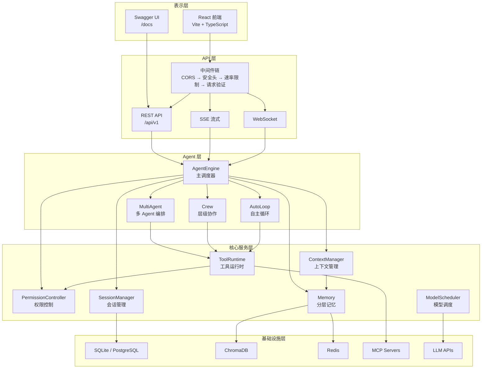

## 核心子系统

### AgentEngine（主引擎）

**目的**: 协调所有组件，驱动 Agent 执行循环
**位置**: `app/core/agent_engine.py`
**依赖**: ModelRegistry, ToolRegistry, SessionManager, ContextManager
**被依赖**: API 层、多 Agent 编排、工作流引擎

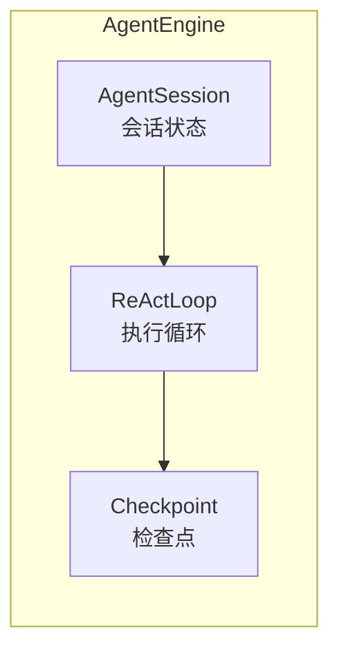

### ContextManager（上下文管理）

**目的**: 组装和管理五层上下文（系统/工作/长期/会话/动态）
**位置**: `app/core/context_manager.py`
**依赖**: Memory, Compressor
**被依赖**: AgentEngine

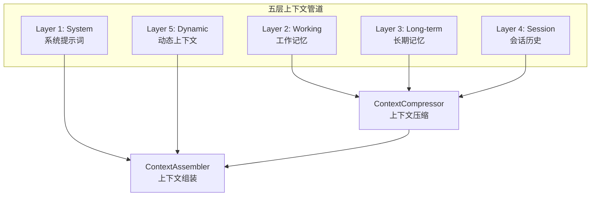

### ToolRuntime（工具运行时）

**目的**: 统一工具注册、发现和执行
**位置**: `app/core/tool_runtime.py`
**依赖**: MCPRegistry, PermissionController
**被依赖**: AgentEngine, MultiAgent

### PermissionController（权限控制）

**目的**: 7 级权限模式管理，危险命令拦截
**位置**: `app/core/permission_controller.py`
**依赖**: PermissionRules
**被依赖**: ToolRuntime, AgentEngine

### ModelScheduler（模型调度）

**目的**: 智能模型选择（成本/速度/可用性三维评分）+ 熔断降级
**位置**: `app/core/model_scheduler.py`
**依赖**: ModelRegistry, CircuitBreaker
**被依赖**: AgentEngine

### SessionManager（会话管理）

**目的**: 会话持久化、检查点/恢复/分叉
**位置**: `app/core/session_manager.py`
**依赖**: CheckpointStore
**被依赖**: AgentEngine

## 数据流

### 聊天请求流

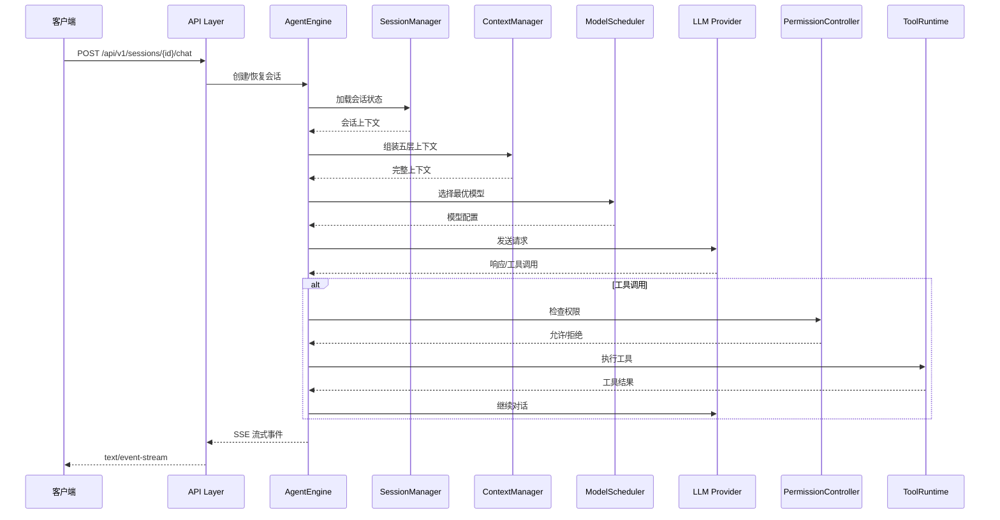

### 多 Agent 协作流

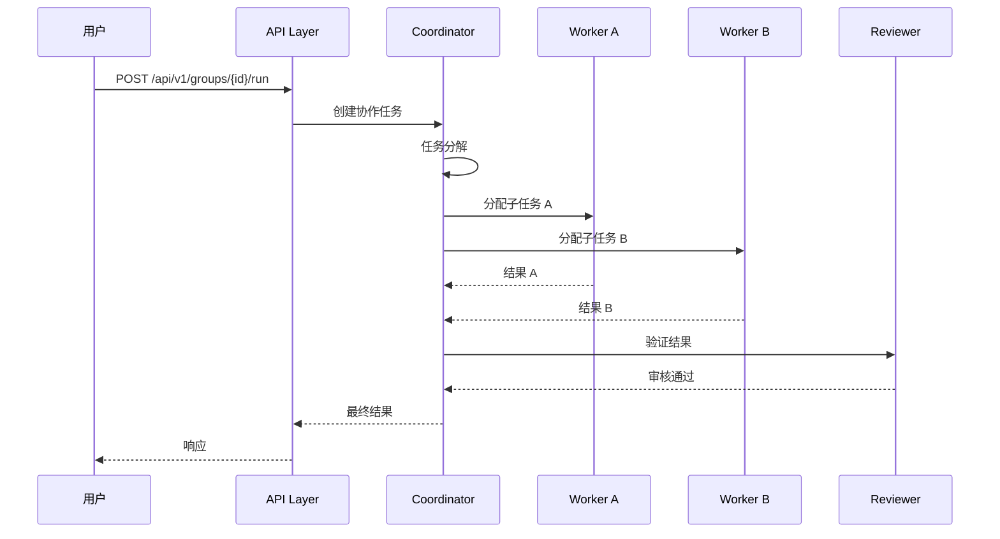

### 会话生命周期

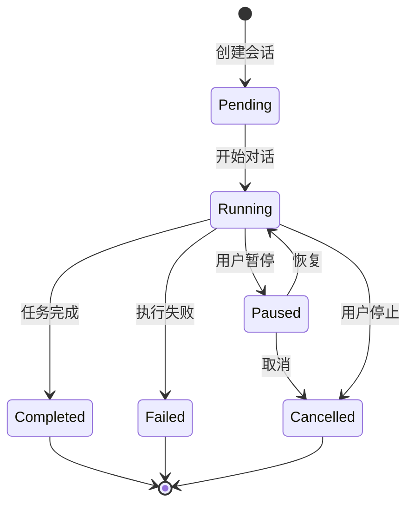

### 权限检查流

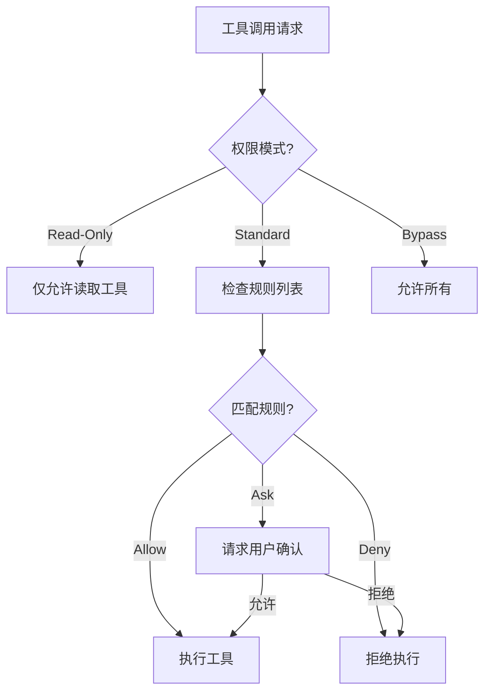

## 模型适配层

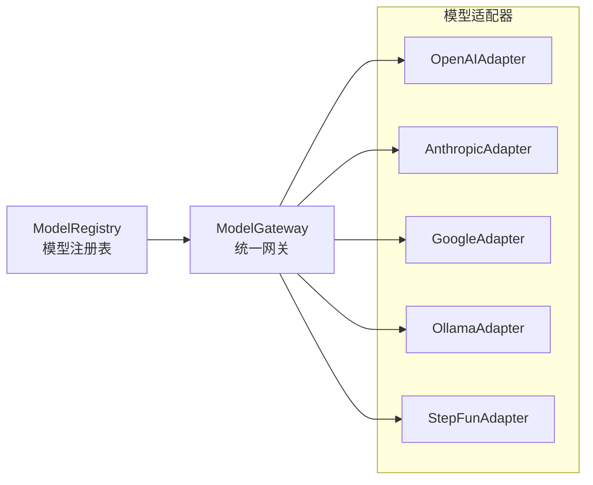

## 存储层

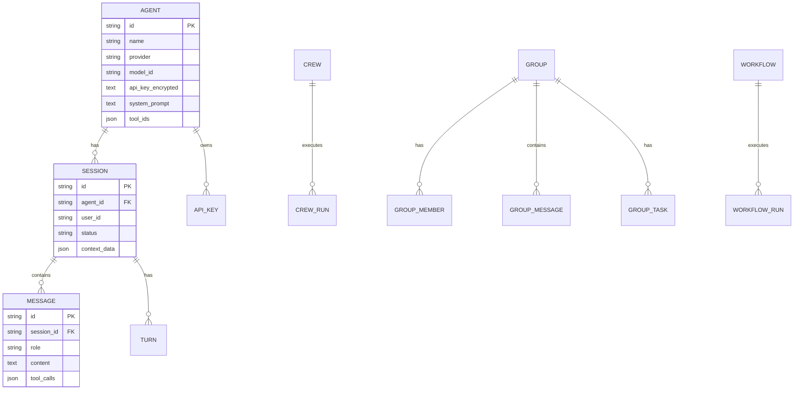

## 安全架构

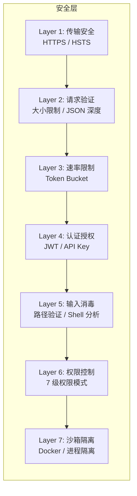

## 部署拓扑

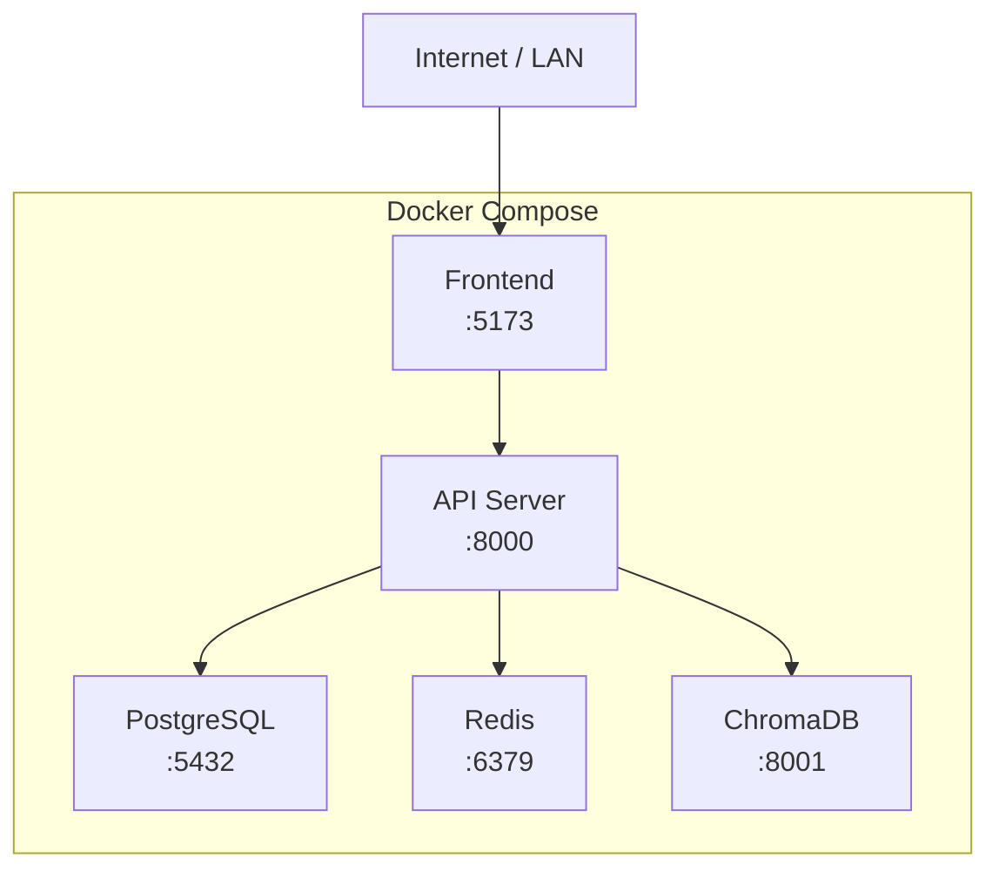
