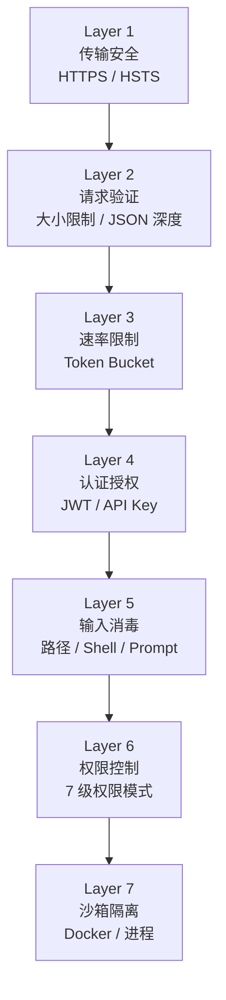
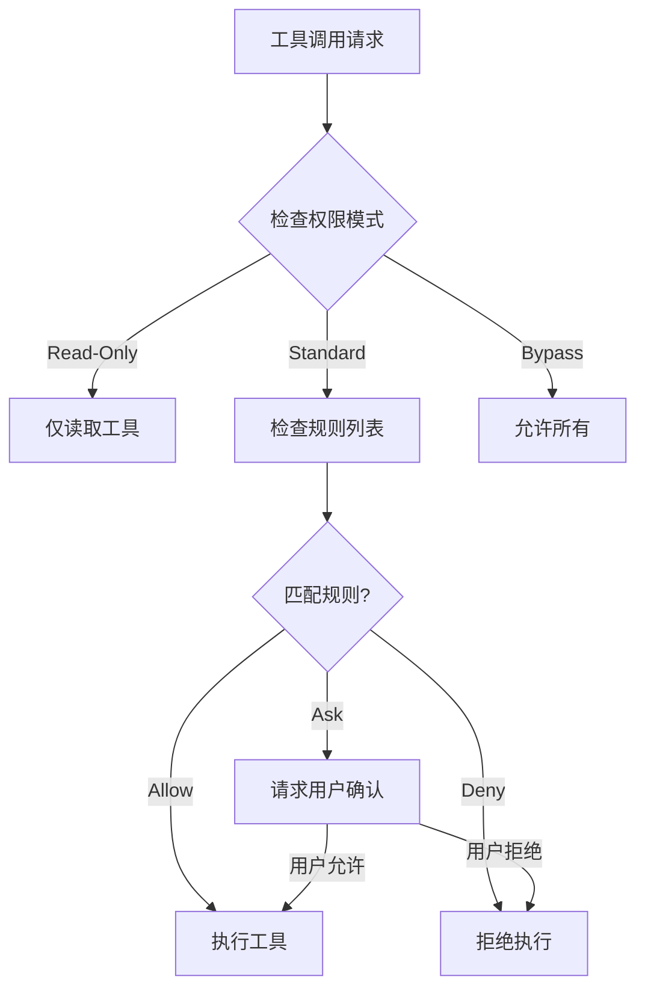

# Climber 安全策略

> 本文档描述 Climber Agent Engine 的安全架构、已知风险和防护措施。

## 目录

- [安全架构概览](#安全架构概览)
- [防护层详解](#防护层详解)
- [权限模型](#权限模型)
- [已知风险与缓解措施](#已知风险与缓解措施)
- [安全配置建议](#安全配置建议)
- [漏洞报告流程](#漏洞报告流程)

---

## 安全架构概览

Climber 采用纵深防御（Defense-in-Depth）策略，通过 7 层安全防护确保系统安全：



---

## 防护层详解

### Layer 1: 传输安全

**防护措施**:
- HSTS (HTTP Strict Transport Security) 强制 HTTPS
- TLS 1.2+ 加密传输
- 证书固定（Certificate Pinning）

**响应头**:
```
Strict-Transport-Security: max-age=31536000; includeSubDomains
```

### Layer 2: 请求验证

**防护措施**:
- 请求体大小限制: 5 MB
- JSON 嵌套深度限制: 10 层
- Content-Type 验证

**配置**:
```python
MAX_CONTENT_LENGTH = 5 * 1024 * 1024  # 5 MB
MAX_JSON_DEPTH = 10
```

**实现**: `app/middleware/security.py`

### Layer 3: 速率限制

**防护措施**:
- 全局请求速率限制
- 用户级别 Token Bucket 算法
- 异常流量检测

**实现**: `app/storage/usage.py` / `app/middleware/rate_limit.py`

### Layer 4: 认证授权

**防护措施**:
- JWT Token 认证
- API Key 加密存储
- 会话隔离

**JWT 配置**:
```env
JWT_SECRET_KEY=<强随机密钥>
JWT_ALGORITHM=HS256
JWT_EXPIRE_MINUTES=1440
```

**API Key 加密**: 使用 AES-256 加密存储于数据库

### Layer 5: 输入消毒

#### 路径穿越防护

**风险**: 攻击者通过 `../` 访问系统文件

**防护**:
```python
class PathValidator:
    def validate(self, path: str) -> Path:
        resolved = Path(path).resolve()
        for root in self._roots:
            try:
                resolved.relative_to(root)
                return resolved
            except ValueError:
                continue
        raise SecurityError("Path outside allowed directories")
```

**配置**:
```env
ALLOWED_PATHS=/workspace/projects,/home/user/workspace
```

#### Shell 命令风险分析

**风险**: 危险命令执行（如 `rm -rf /`）

**防护**:
- 命令风险等级评估
- 正则表达式模式匹配
- 用户确认机制

#### Prompt 注入检测

**风险**: 恶意 Prompt 诱导 Agent 执行危险操作

**防护**:
- 输入内容扫描
- 危险模式检测
- 上下文隔离

**实现**: `app/core/security_utils.py`

### Layer 6: 权限控制

**7 级权限模式**:

| 级别 | 模式 | 说明 |
|------|------|------|
| 1 | Read-Only | 仅允许读取操作 |
| 2 | Standard | 标准权限，危险操作需确认 |
| 3 | Elevated | 提升权限，允许写入 |
| 4 | Admin | 管理权限 |
| 5 | Unrestricted | 无限制 |
| 6 | Bypass | 绕过所有检查 |
| 7 | Debug | 调试模式 |

**权限规则引擎**:
```json
{
  "mode": "standard",
  "rules": [
    {"decision": "allow", "tool": "read_file"},
    {"decision": "deny", "tool": "shell_exec", "pattern": "rm -rf"},
    {"decision": "ask", "tool": "write_file"}
  ],
  "allowed_tools": ["read_file", "list_files"],
  "denied_tools": ["shell_exec"]
}
```

**实现**: `app/core/permission_controller.py` / `app/core/permission_rules.py`

### Layer 7: 沙箱隔离

**防护措施**:
- Docker 容器隔离
- 进程级沙箱
- 文件系统隔离

**Docker 沙箱配置**:
```python
class SandboxConfig:
    enabled: bool = False
    memory_limit: str = "512m"
    cpu_limit: float = 1.0
    network_mode: str = "none"
    read_only_root: bool = True
```

**实现**: `app/core/docker_sandbox.py` / `app/core/sandbox.py`

---

## 权限模型



---

## 已知风险与缓解措施

### 1. Prompt 注入攻击

**风险等级**: 高

**描述**: 用户输入中嵌入恶意指令，诱导 Agent 执行非预期操作。

**缓解措施**:
- 系统提示词与用户输入隔离
- 输入内容安全扫描
- 工具调用权限检查
- Agent 行为审计日志

**相关代码**: `app/core/security_utils.py`

### 2. 路径穿越

**风险等级**: 高

**描述**: 通过构造特殊路径访问系统敏感文件。

**缓解措施**:
- 路径规范化（resolve）
- 根目录限制
- 符号链接追踪

**配置**:
```env
SANDBOX_MODE=true
ALLOWED_PATHS=/workspace/projects
```

### 3. Shell 命令注入

**风险等级**: 高

**描述**: 通过工具调用执行危险 Shell 命令。

**缓解措施**:
- 命令白名单
- 风险模式匹配
- 用户确认机制
- 沙箱执行环境

### 4. 模型 API Key 泄露

**风险等级**: 中

**描述**: API Key 被未授权访问或日志泄露。

**缓解措施**:
- AES-256 加密存储
- 内存中解密，不持久化明文
- 日志脱敏
- Key 轮换机制

**实现**: `app/core/api_key_crypto.py`

### 5. 会话劫持

**风险等级**: 中

**描述**: 攻击者获取有效会话 Token 冒充用户。

**缓解措施**:
- JWT 过期机制
- Token 绑定用户 ID
- 会话所有权验证
- HTTPS 传输加密

### 6. 资源耗尽

**风险等级**: 中

**描述**: 恶意请求消耗大量 Token 或计算资源。

**缓解措施**:
- 速率限制
- Token 用量上限
- 内存使用限制
- 迭代次数上限

**配置**:
```env
MAX_TOKENS_PER_SESSION=100000
MAX_COST_PER_DAY=10.0
MEMORY_LIMIT_MB=2048
```

### 7. 跨站脚本 (XSS)

**风险等级**: 低

**描述**: 前端渲染恶意脚本。

**缓解措施**:
- Content-Security-Policy 头
- 输入消毒
- React 自动转义

**响应头**:
```
Content-Security-Policy: default-src 'self'
X-XSS-Protection: 1; mode=block
```

### 8. 跨站请求伪造 (CSRF)

**风险等级**: 低

**描述**: 伪造用户请求执行操作。

**缓解措施**:
- CORS 白名单
- SameSite Cookie
- CSRF Token

---

## 安全配置建议

### 最小权限配置

```env
# 基础安全配置
APP_DEBUG=false
SANDBOX_MODE=true
ALLOWED_PATHS=/workspace/projects
LOG_LEVEL=WARN

# 认证
JWT_SECRET_KEY=<32+字节随机密钥>
JWT_EXPIRE_MINUTES=60

# 限制
MAX_TOKENS_PER_SESSION=50000
MAX_COST_PER_DAY=5.0
MEMORY_LIMIT_MB=1024
```

### 生产环境安全清单

- [ ] 修改所有默认密钥（APP_SECRET_KEY, JWT_SECRET_KEY）
- [ ] 启用沙箱模式（SANDBOX_MODE=true）
- [ ] 配置 ALLOWED_PATHS 限制文件访问
- [ ] 启用 HTTPS
- [ ] 配置 CORS 白名单
- [ ] 设置 Token 用量上限
- [ ] 启用结构化日志
- [ ] 配置监控告警
- [ ] 定期轮换 API Key
- [ ] 备份数据库

### Docker 安全

```dockerfile
# 使用非 root 用户运行
RUN useradd -m climber
USER climber

# 只读文件系统
READ_ONLY_ROOT=true

# 资源限制
--memory=2g --cpus=1.0
```

### Nginx 安全头

```nginx
add_header X-Content-Type-Options nosniff;
add_header X-Frame-Options DENY;
add_header X-XSS-Protection "1; mode=block";
add_header Referrer-Policy strict-origin-when-cross-origin;
add_header Strict-Transport-Security "max-age=31536000; includeSubDomains";
add_header Content-Security-Policy "default-src 'self'";
add_header Permissions-Policy "camera=(), microphone=(), geolocation=()";
```

---

## 安全审计

### 审计日志

所有安全相关事件记录结构化日志：

```python
logger.info("permission_check", 
    tool="shell_exec", 
    decision="deny", 
    pattern="rm -rf",
    user_id="default-user"
)
```

### 审计端点

```bash
# 查看健康状态
curl http://localhost:8000/health

# 查看日志
curl http://localhost:8000/health/logs?errors_only=true

# 系统诊断
curl http://localhost:8000/api/v1/doctor/
```

### 关键监控指标

| 指标 | 说明 | 告警阈值 |
|------|------|---------|
| `security_permission_denied` | 权限拒绝次数 | > 10/小时 |
| `security_path_violation` | 路径穿越尝试 | > 0 |
| `security_shell_risk` | Shell 风险命令 | > 5/小时 |
| `rate_limit_exceeded` | 速率限制触发 | > 20/小时 |

---

## 漏洞报告流程

### 报告方式

如发现安全漏洞，请通过以下方式报告：

1. **GitHub Security Advisory**: 使用仓库的 Security 标签
2. **邮件**: 发送详细描述至项目维护者

### 报告内容

- 漏洞描述
- 复现步骤
- 影响范围
- 建议修复方案

### 响应时间

| 严重等级 | 响应时间 |
|---------|---------|
| Critical | 24 小时内 |
| High | 48 小时内 |
| Medium | 1 周内 |
| Low | 2 周内 |

### 安全更新

安全修复将通过以下方式发布：
- GitHub Release
- Security Advisory
- Changelog 更新
